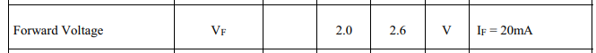
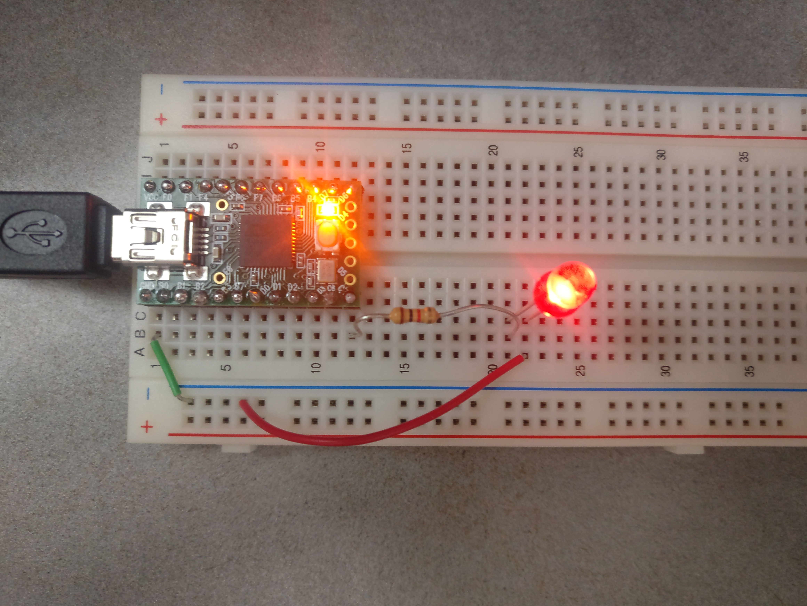
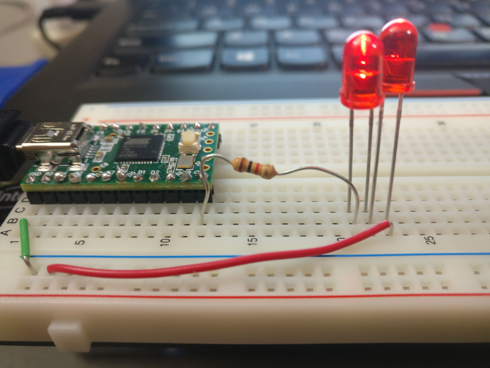
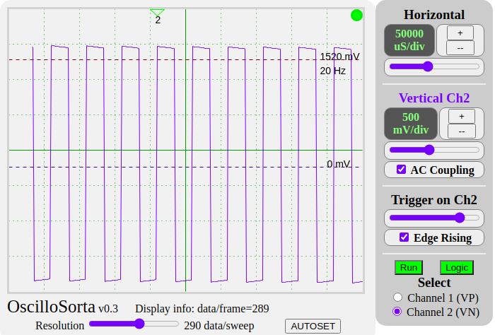
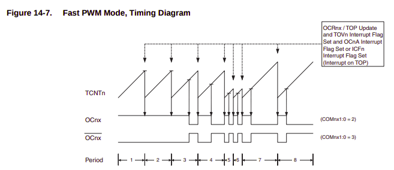
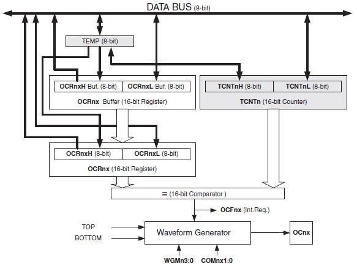
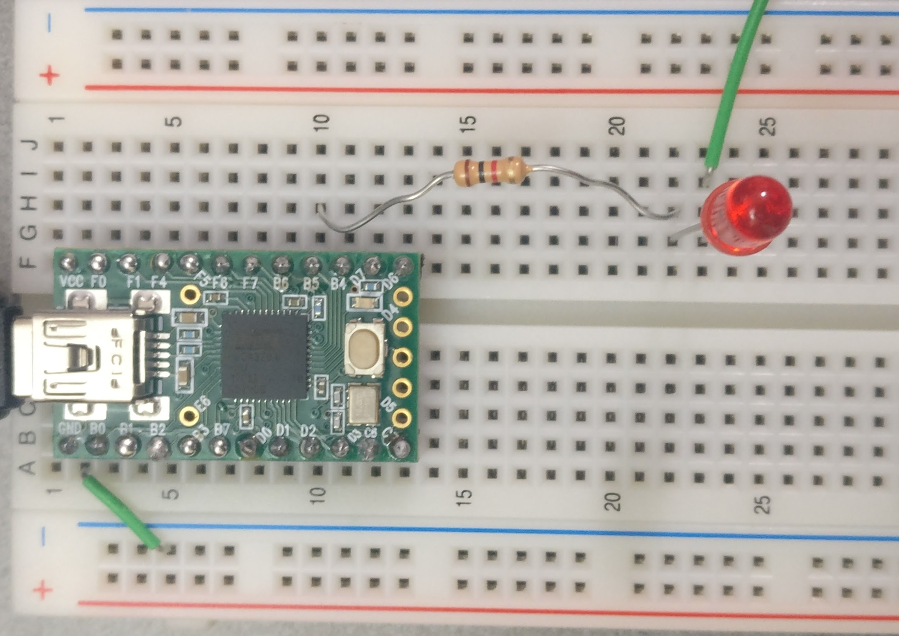
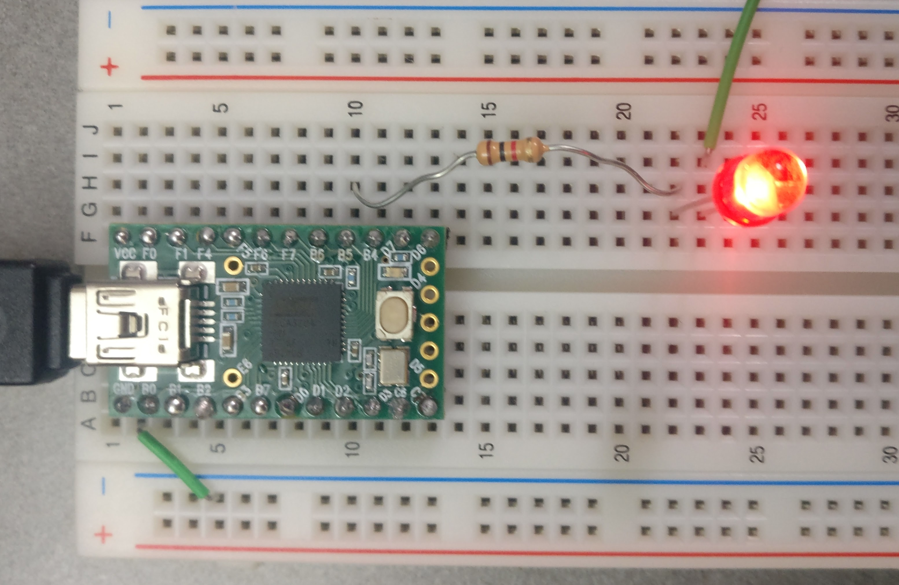
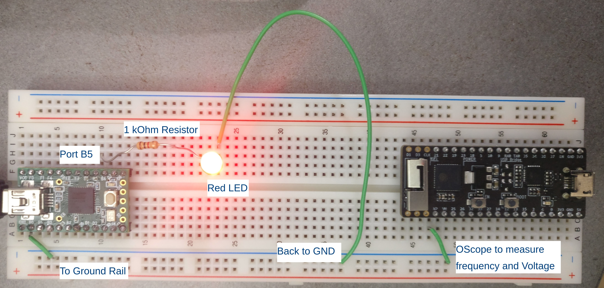

# Lab 1 - Microcontrollers

Sheil Sarda <sheils@seas.upenn.edu>

## 1. LED

### 1.1.1 Ranges of Resistance for LED

[Digikey datasheet for 160-1128-ND ​LTL-4224 ​5mm red LED](https://media.digikey.com/pdf/Data%20Sheets/Lite-On%20PDFs/LTL-4224.pdf)

#### From Page 3:



#### Calculate the smallest resistor that you can safely use with this LED in series with 5V power. 


| 	| 		|
| :------------- | :----------: |
| Continuous Forward Current (If)	| 20 mA 				|
| Battery Voltage (V)				| 5 V   				|
| Forward Voltage (Vf)				| 2-2.6 V  				|
| Max Voltage across resistor		| 5 - 2 = 3V 			|
| **Resistance (R)**		| 3V / 20mA = **150 Ohms** 	|
| 	| 		|

### 1.1.2 Optimal Resistance for Dim Light

Resistance for Dim Light = 10 KOhms

| 	| 		|
| :------------- | :----------: |
| Battery Voltage (V)				| 5 V   					|
| Forward Voltage (Vf)				| 2-2.6 V  					|
| Max Voltage across resistor		| 5 - 2 = 3V 				|
| Resistance (R)					| 10 KOhms				 	|
| **Current (If)**					| 3V / 10 KOhms = **0.3 mA**|
| 	| 		|

### 1.1.3 Two LEDs in Parallel

LEDs chosen

| LED Type	| Forward Voltage	| Current |
| :------------- | :----------: | :----------: |
|[160-1128-ND ​LTL-4224 ​5mm red LED](https://media.digikey.com/pdf/Data%20Sheets/Lite-On%20PDFs/LTL-4238.pdf) 		| 	2V	| 20 mA |
|[160-1132-ND ​LTL-4238 ​ 5mm green LED](https://www.digikey.com/htmldatasheets/production/33348/0/0/1/ltl-4238.html) 	|  2.1V	| 20 mA |
| 	| 		|

Based on the specifications, I would expect the Red LED to be slightly brighter than the green LED because of the lower forward voltage drop.

Measured voltage at A: **1.90 V**. The Red LED is slightly brighter.

### 1.1.4 Two LEDs in Series

Measured voltage at A: **3.81V**. 

Voltage between the 2 LEDs: **1.95V**

This is expected based on the datasheets, because due to current being the same for both LEDs in series, causing the voltage drop in the middle of the two to be approximately half of the voltage at A.

### 1.1.5 Optimal LED for a Table Lamp

[American Bright Optoelectronics Corporation AB-EZP10A-B3-K13](https://www.digikey.com/en/products/detail/american-bright-optoelectronics-corporation/AB-EZP10A-B3-K13/9677930)

Cost: $1.91

Size / Dimension: 0.118"" L x 0.118"" W (3.00mm x 3.00mm)

Features:

- Luminous intensity remains constant for 10.4V < Vin < 24V
- Can actively modulate the power usage by decreasing the input current to avoid overheating.
- The input current, light output, and color temperature can stay consistent despite the exterior voltage changes or fluctuations.
- Uses conventional 12 V / 24 VDC voltage sources


## 2. Introduction to Teensy 

### 1.2.1 Modified Registers

- Data Direction Register `DDRC`
- GPIO Pinout `PORTC`

### 1.2.2 Circuit Diagram

#### Circuit Diagram



#### Choice of Hardware

- Used 1kOhm current limiting resistor
- Used ground pin from the Teensy (which comes from laptop)
- Used Red LED since it was easiest to detect whether its on / off

### 1.2.3 Variable Frequency

Frequency appears to be continually on at around 60Hz

#### C Code

````c
#include "teensy_general.h"  // includes the resources included in the teensy_general.h file

#define FREQ_HZ 60 // variable for frequency

int main(void)
{
    /* insert your hardware initialization here */

    teensy_clockdivide(0); //set the clock speed
    set(DDRC, 7);

    for(;;){
        toggle(PORTC, 7);
        teensy_led(TOGGLE);     // switch the led state
        teensy_wait(1000/FREQ_HZ);              // wait
    }
    return 0;   /* never reached */
}
````

### 1.2.4 Variable Duty Cycle

````c
#include "teensy_general.h"  // includes the resources included in the teensy_general.h file

#define FREQ_HZ 10 // variable for frequency
#define DUTY_CYCLE 50 // variable for duty cycle percentage

int main(void)
{

    teensy_clockdivide(0); //set the clock speed
    set(DDRC, 7);

    for(;;){
        /* ON Part of the Duty Cycle */
        toggle(PORTC, 7);
        teensy_wait(10 * DUTY_CYCLE / FREQ_HZ);         // wait

        /* OFF Part of the Duty Cycle */
        clear(PORTC, 7);
        teensy_wait(10 * (100 - DUTY_CYCLE) / FREQ_HZ);         // wait
    }
    return 0;   /* never reached */
}
````

### 1.2.5 Maximum LEDs from a GPIO Pin

#### Circuit Diagram




#### Limitations

Since each red LED uses 2V, and each GPIO pin of the Teensy outputs 5V and 20 mA we can connect up to 2 LEDs at visible brightness (since 2V + 2V < 5V).

The GPIO output voltage of the Teensy is the limiting factor.

## 3. Timers

### 1.3.1 Use the timer to get 20Hz

#### Oscilloscope Output



#### C Code

````c
#include "teensy_general.h"  // includes the resources included in the teensy_general.h file

#define FREQ_HZ 20 // variable for frequency
#define PRESCALAR 256 // prescalar used
#define SYS_CLOCK 16e6 // clock speed (16 Mhz)
int main(void)
{
    /* insert your hardware initialization here */

    teensy_clockdivide(0); //set the clock speed
    set(DDRC, 7);

    set(TCCR1B, CS12); // set 256 prescalar

    TCNT1 = 0x00;
    long cutoff = SYS_CLOCK/(2*FREQ_HZ*PRESCALAR);

    for(;;){

        if(TCNT1 > cutoff){
            toggle(PORTC, 7);
            teensy_led(TOGGLE);
            TCNT1 = 0x00;
        }
    }
    return 0;   /* never reached */
}


````

### 1.3.2 Adjust the Pre-scaler

Adjusted the pre-scalar in the code snippet for 1.3.1.

The default system clock frequency is 16MHz.

### 1.3.3 PWM functions of timer

Do the same thing you did in 1.2.4

#### Timer options used



- Output compare is set on the compare match between `TCNT1` and `OCR1A`
- Mode 14 on Timer 1 to count up to `ICR1`
- Toggling Port `B5` at Output Compare Match
- Set Compare match registers `ICR1` and `OCR1A`
- `256x` prescalar
- Set `OC1A` on compare match when up-counting and clear on compare match



#### Duty Cycles 

##### 0% cycle



##### 100% cycle



#### C Code

````c
#include "teensy_general.h"  // includes the resources included in the teensy_general.h file

#define FREQ_HZ    1    // variable for frequency
#define PRESCALAR  256  // prescalar used
#define SYS_CLOCK  16e6 // clock speed (16 Mhz)
#define DUTY_CYCLE 1    // duty cycle 

int main(void)
{
    set(TCCR1B, CS12); // set 256 prescalar    
    teensy_clockdivide(0); //set the clock speed

    set(DDRB, 5); // B5 is output compare pin

    // (mode 14) UP to ICR1, PWM mode
    set(TCCR1B, WGM13); set(TCCR1B, WGM12); set(TCCR1A, WGM11);

    // clear B5 at OC (to start off part of duty cycle)
    set(TCCR1A, COM1A1); 

    // set compare match register
    ICR1  = SYS_CLOCK/(FREQ_HZ*PRESCALAR); 
    // set duty cycle PWM
    OCR1A = ICR1*DUTY_CYCLE;  

    while(1);
    return 0;   /* never reached */
}

```` 

#### [Video Demonstration](https://www.youtube.com/watch?v=AvenU_oT04E)

## 4. Practice with Loops

### 1.4.1 Make the External LED Pulse

#### Part A

The pulse should start at 0 intensity, take 1 second to increase in intensity until it is full brightness, then 1 second to decrease in brightness and repeat.

````c
#include "teensy_general.h"  // includes the resources included in the teensy_general.h file

#define FREQ_HZ    50    // variable for frequency
#define PRESCALAR  256  // prescalar used
#define SYS_CLOCK  16e6 // clock speed (16 Mhz)

int main(void)
{
    set(TCCR1B, CS12); // set 256 prescalar    
    teensy_clockdivide(0); //set the clock speed

    set(DDRB, 5); // B5 is output compare pin

    // (mode 14) UP to ICR1, PWM mode
    set(TCCR1B, WGM13); set(TCCR1B, WGM12); set(TCCR1A, WGM11);

    // toggle B5 at OC
    set(TCCR1A, COM1A1); 

    /* Set OC1A on compare match when upcounting. Clear OC1A 
     * on compare match when down-counting. 
     */
    set(TCCR1B, WGM13); set(TCCR1B, WGM12);
    
    // set compare match register
    ICR1  = SYS_CLOCK/(FREQ_HZ*PRESCALAR); 
    
    double arr[] = {0, 0.05, 0.2, 0.5, 1, 1}; // duty cycles
    int len = (sizeof(arr) / sizeof(double));
    int delay_time = 1000/len; // how much time to spend at each duty cycle
    
    while(1){
        // rising
        for(int i = 0; i < len; ++i){
            OCR1A = ICR1*arr[i];
	    _delay_ms(delay_time);
        }
        // falling
        for(int i = len-1; i >= 0; --i){
            OCR1A = ICR1*arr[i];
	    _delay_ms(delay_time);
        }
    }

    return 0;   /* never reached */
}
````

#### Part B

- Make the time to increase and the time to decrease a variable. 
- Make a video with the following configuration:
    - 0.3 second to full intensity 
    - 0.7 seconds to 0 intensity

##### [Video of Asymetric Pulses](https://www.youtube.com/watch?v=4eq2Xa6Y1UU)

##### C Code

````c
#include "teensy_general.h"  // includes the resources included in the teensy_general.h file

#define FREQ_HZ    50    // variable for frequency
#define PRESCALAR  256  // prescalar used
#define SYS_CLOCK  16e6 // clock speed (16 Mhz)

#define RISE_TIME 300 // time in ms to full intensity
#define FALL_TIME 700 // time in ms to 0 intensity

int main(void)
{
    set(TCCR1B, CS12); // set 256 prescalar    
    teensy_clockdivide(0); //set the clock speed

    set(DDRB, 5); // B5 is output compare pin

    // (mode 14) UP to ICR1, PWM mode
    set(TCCR1B, WGM13); set(TCCR1B, WGM12); set(TCCR1A, WGM11);

    // toggle B5 at OC
    set(TCCR1A, COM1A1); 

    /* Set OC1A on compare match when upcounting. Clear OC1A 
     * on compare match when down-counting. 
     */
    set(TCCR1B, WGM13); set(TCCR1B, WGM12);
    
    // set compare match register
    ICR1  = SYS_CLOCK/(FREQ_HZ*PRESCALAR); 
    
    double arr[] = {0, 0.05, 0.2, 0.5, 1, 1};
    int len = (sizeof(arr) / sizeof(double));

    // time to spend at each duty cycle
    int rise_ms = RISE_TIME/len; 
    int fall_ms = FALL_TIME/len; 
    
    while(1){
        // rising
        for(int i = 0; i < len; ++i){
            OCR1A = ICR1*arr[i];
	    _delay_ms(rise_ms);
        }
        // falling
        for(int i = len-1; i >= 0; --i){
            OCR1A = ICR1*arr[i];
	    _delay_ms(fall_ms);
        }
    }

    return 0;   /* never reached */
}

```` 

##### Circuit Diagram



### 1.4.2 Pulsing LED like Heartbeat

#### Refactor code to use Subroutines and make Max Intensity variable

Uses the following defined variables:
- `RISE_TIME`
- `MAX_INTENSITY`
- `FREQ_HZ`
- `PRESCALAR`
- `SYS_CLOCK`

Assumes LED is plugged into Port `B5`, and that Timer 1 is not being used.

#### Make the LED blink as if it were a heartbeat

LED percentage intensity `i` should follow the pattern below at time `t` seconds but smoothly interpolated intensities between each value:

|             	|     	|     	|     	|     	|     	|     	|     	|     	|     	|     	|
|-------------	|-----	|-----	|-----	|-----	|-----	|-----	|-----	|-----	|-----	|-----	|
| Time `t`      	| 0.0 	| 0.1 	| 0.5 	| 0.6 	| 1.0 	| 3.0 	| 3.1 	| 3.5 	| 3.6 	| 4.0 	|
| Intensity `i` 	| 0   	| 100 	| 0   	| 50  	| 0   	| 0   	| 100 	| 0   	| 50  	| 0   	|
|             	|     	|     	|     	|     	|     	|     	|     	|     	|     	|     	|

##### [Heartbeat LED Video](https://www.youtube.com/watch?v=JGBtVaQb_6o)

##### C Code

````c
#include "teensy_general.h"  // includes the resources included in the teensy_general.h file

#define FREQ_HZ    50    // variable for frequency
#define PRESCALAR  256  // prescalar used
#define SYS_CLOCK  16e6 // clock speed (16 Mhz)

#define RISE_TIME 4000 // time in ms to full intensity
#define MAX_INTENSITY 1 // max intensity
#define LERP 5 // number of points to lerp between variable
double intensity[] = {0,1,0.75,0.5,0.25,0,0.5,0.375,0.25,0.125,0,0,0,0,0,0,0,0,0,0,0,0,0,0,0,0,0,0,0,0,0};

/* 
 * Uses the following defined variables
 * `RISE_TIME`, `FALL_TIME`, `MAX_INTENSITY`,
 * `FREQ_HZ`, `PRESCALAR` and `SYS_CLOCK`
 * Assumes LED is plugged into Port `B5`
 * Uses Timer 1 for PWM functionality
 */
void pulse_led(){
    set(TCCR1B, CS12); // set 256 prescalar    
    teensy_clockdivide(0); //set the clock speed

    set(DDRB, 5); // B5 is output compare pin

    // (mode 14) UP to ICR1, PWM mode
    set(TCCR1B, WGM13); set(TCCR1B, WGM12); set(TCCR1A, WGM11);

    // toggle B5 at OC
    set(TCCR1A, COM1A1); 

    /* Set OC1A on compare match when upcounting. Clear OC1A 
     * on compare match when down-counting. 
     */
    set(TCCR1B, WGM13); set(TCCR1B, WGM12);
    
    // set compare match register
    ICR1  = SYS_CLOCK/(FREQ_HZ*PRESCALAR); 
    
    int len = (sizeof(intensity) / sizeof(double));

    // time to spend at each duty cycle
    int rise_ms = RISE_TIME/(len*LERP); 
    
    int lerp_i = 0;
    double lerp_intensity;
    
    while(1){
        for(int i = 0; i < len; ++i){
	    // LERP between values
	    if(i < len - 1){ 
            
	        for(lerp_i = 0; lerp_i < LERP; ++lerp_i){
               
  	           lerp_intensity = (intensity[i+1] - intensity[i])*(lerp_i/LERP);
    	           lerp_intensity += intensity[i];

	           OCR1A = ICR1*lerp_intensity*MAX_INTENSITY;
                   _delay_ms(rise_ms);
	        }
	    } else { // last value in array
		OCR1A = ICR1*intensity[i]*MAX_INTENSITY;
                _delay_ms(rise_ms);
	    }
        }
    }
}

int main(void)
{
    pulse_led();
    return 0;   /* never reached */
}

````

### 1.4.3 **Extra Credit** Weaker Heartbeat

- Heartbeat stays at a constant frequency, but maximum intensity slowly fades as if the heartbeat is getting weaker
- Have it take 20 beats before it is reduced to 0 intensity
- Show a TA your LED blinking; answer his/her questions, and get signed off

#### C Code

````c
#include "teensy_general.h"  // includes the resources included in the teensy_general.h file

#define FREQ_HZ    100    // variable for frequency
#define PRESCALAR  256  // prescalar used
#define SYS_CLOCK  16e6 // clock speed (16 Mhz)

#define RISE_TIME 4000 // time in ms to full intensity
#define LERP 5 // number of points to lerp between variable
#define TOTAL_BEATS 20 // heartbeat goes to zero intensity after these beats


double intensity[] = {0,1,0.75,0.5,0.25,0,0.5,0.375,0.25,0.125,0,0,0,0,0,0,0,0,0,0,0,0,0,0,0,0,0,0,0,0,0};

/* 
 * Uses the following defined variables
 * `RISE_TIME`, `FALL_TIME`, `MAX_INTENSITY`,
 * `FREQ_HZ`, `PRESCALAR` and `SYS_CLOCK`
 * Assumes LED is plugged into Port `B5`
 * Uses Timer 1 for PWM functionality
 */
void pulse_led(){
    set(TCCR1B, CS12); // set 256 prescalar    
    teensy_clockdivide(0); //set the clock speed

    set(DDRB, 5); // B5 is output compare pin

    // (mode 14) UP to ICR1, PWM mode
    set(TCCR1B, WGM13); set(TCCR1B, WGM12); set(TCCR1A, WGM11);

    // toggle B5 at OC
    set(TCCR1A, COM1A1); 

    /* Set OC1A on compare match when upcounting. Clear OC1A 
     * on compare match when down-counting. 
     */
    set(TCCR1B, WGM13); set(TCCR1B, WGM12);
    
    // set compare match register
    ICR1  = SYS_CLOCK/(FREQ_HZ*PRESCALAR); 
    
    int len = (sizeof(intensity) / sizeof(double));

    // time to spend at each duty cycle
    int rise_ms = RISE_TIME/(len*LERP); 
    
    int lerp_i = 0;
    double lerp_intensity;
    
    int beat_count = 1;
    double max_intensity = 1.0;

    while(1){
        for(int i = 0; i < len; ++i){
	    // LERP between values
	    if(i < len - 1){ 
            
	        for(lerp_i = 0; lerp_i < LERP; ++lerp_i){
               
  	           lerp_intensity = (intensity[i+1] - intensity[i])*(lerp_i/LERP);
    	           lerp_intensity += intensity[i];
		   
		   max_intensity = 1- (beat_count*(i * len)*(lerp_i * LERP))
			   /(len*LERP*TOTAL_BEATS);

	           OCR1A = ICR1*lerp_intensity*max_intensity;
                   _delay_ms(rise_ms);
	           
	           
	        }
	    } else { // last value in array
		OCR1A = ICR1*intensity[i]*max_intensity;
                _delay_ms(rise_ms);
	    }
        }
        if(beat_count > TOTAL_BEATS) break;
        beat_count++;
    }
}

int main(void)
{
    pulse_led();
    return 0;   /* never reached */
}


````

## 5. Retrospective 

- Spent approximately 20 hours on this lab.
- Spent 10+ hours on the Timers and Loops part of the lab combined
- Additionally, spent 5 hours on the Extra Credit


