# Lab 2 - Capturing Inputs

Sheil Sarda <sheils@seas.upenn.edu>

## 1. Switches, Debouncing and Input Capture

### 2.1.1 SPST Switch Wiring

#### Circuit Diagram

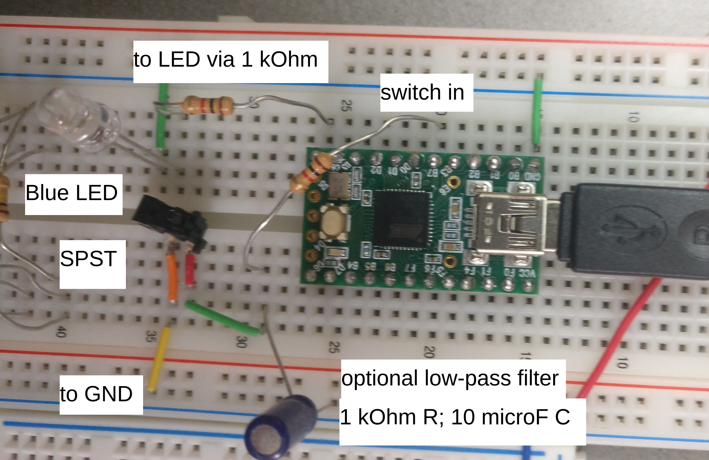

#### C Code

````c
#include "teensy_general.h"
#include "t_usb.h"

int main(void){
    m_usb_init();

    set(TCCR1B, CS12); // set 256 prescalar    
    teensy_clockdivide(0); //set the clock speed

    clear(DDRB, 7); // B7 is input
    set(PORTB, 7);  // set internal pullup

    set(DDRC, 7);  // C7 is output 
    clear(PORTC, 7); // no LED

    while(!m_usb_isconnected()); // wait for a connection
    while(1){
	// detect if button is pressed
        if(!bit_is_set(PINB, 7)){
            set(PORTC, 7);
	    teensy_led(ON);
	    m_usb_tx_string("Bit is set\r\n");
	} else {
	    // button is not pressed
	    clear(PORTC, 7);
	    teensy_led(OFF);
	}
    }
}

````

### 2.1.2 Debouncing the SPST

#### Add resistor and capacitor low-pass filter between the switch and the Teensy

**Notes**

- Make sure you have a large enough RC time constant so that you don’t see multiple bounces on a single press (i.e., 100Hz bounces)
- Not too large that you distort button presses that occur at roughly 10 times per second (faster than most humans can press). 

#### Verify RC Circuit

- Use the output of a square wave from a function generator into the RC circuit and view the output on an oscilloscope or your OscilloSorta. 
- Notice how the signal changes as the frequency goes from below 10Hz to above 100Hz.
- Submit OscilloSorta images for each case. Ideally two traces:
    - one with output of input signal square wave 
    - one with filtered output 
- Show your calculation for the cutoff frequency of your low pass filter.

##### 3Hz Wave

Raw

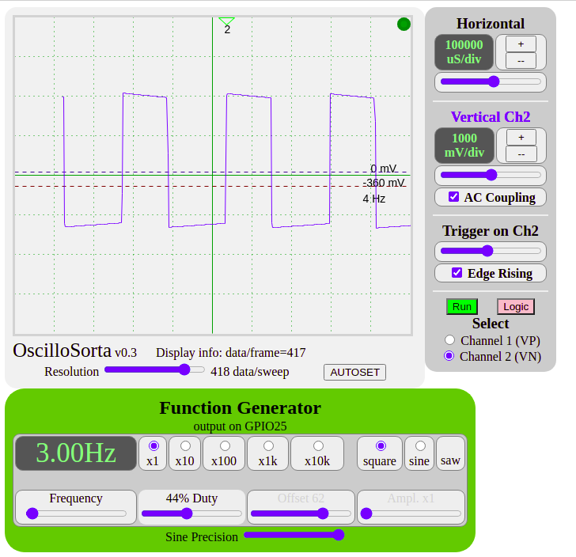

Filtered

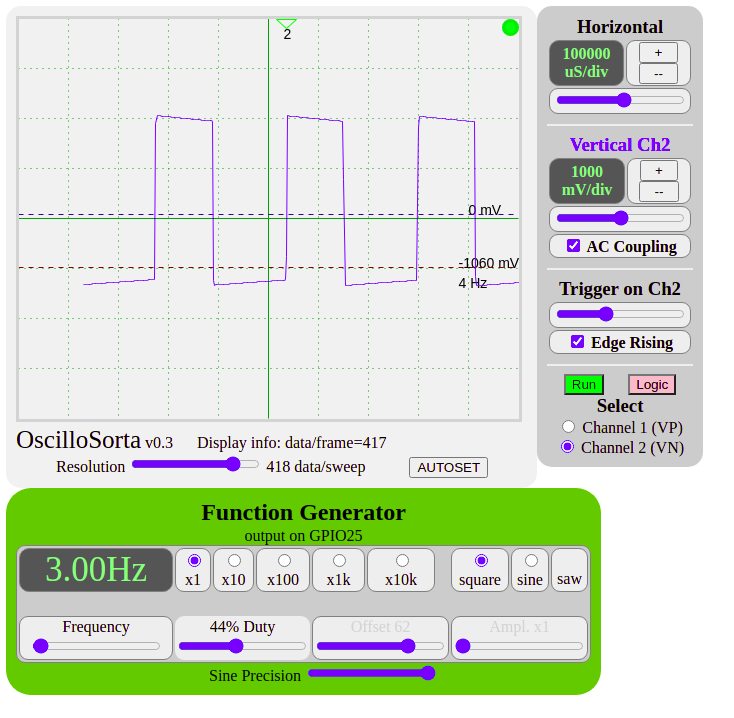

##### 270Hz Wave

Raw

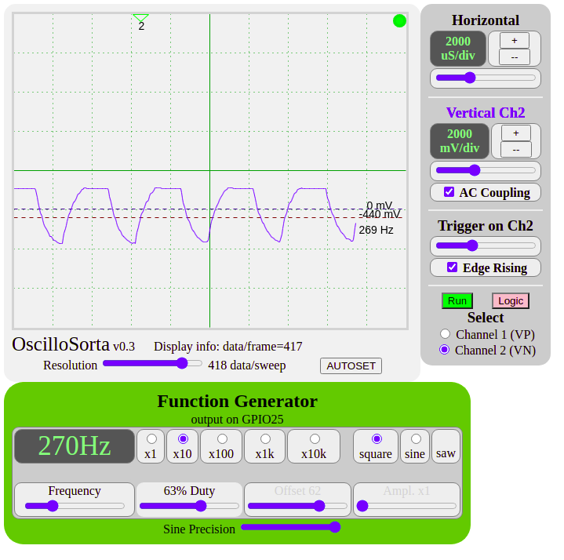

Filtered

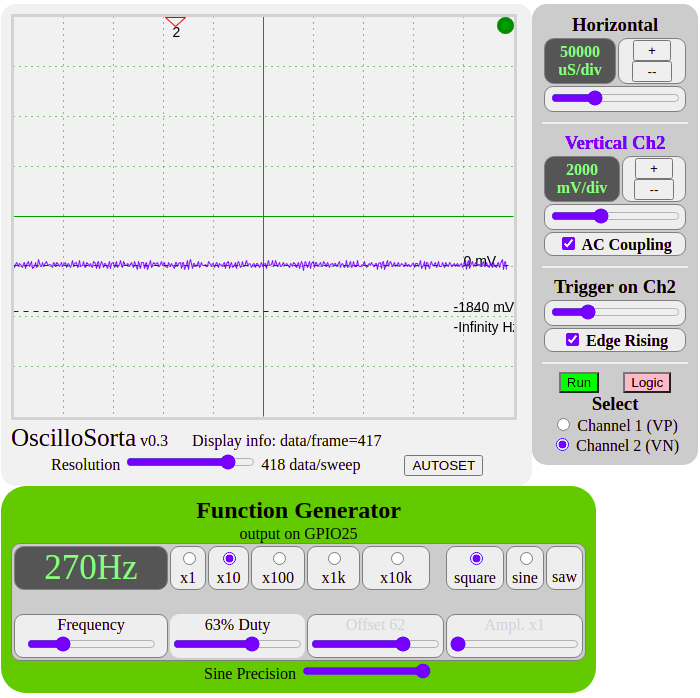

##### Cutoff Frequency Calculation

Cutoff Frequency = `1/(2*pi*R*C) = 15Hz` for:

- 1 kOhm Resistor
- 10 microFarad Capacitor

#### Schematic w/ Low Pass Filter

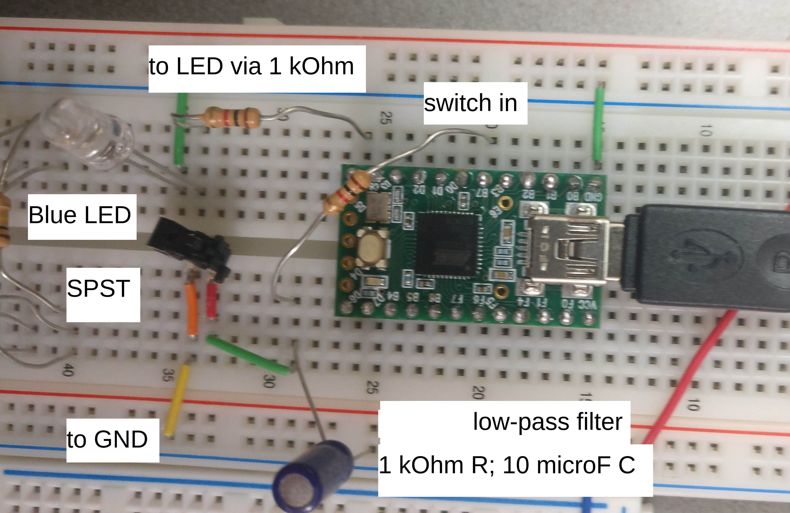

#### Human Reaction Speed

Change the code so that it:
1. prompts the person when to start
1. measures 5 presses 
1. prints out the average time between the 5 presses in milliseconds

**Test Runs**

| Tries | Fastest Time (ms) |
| ----- | ------------ |
| 1     |      312        |
| 2     |      259        |
| 3     |      559        |
| 4     |      367        |
| 5     |      412        |

#### C Code 

````c
#include "teensy_general.h"
#include "t_usb.h"
#include <string.h>
#include <stdbool.h>
#include <stdio.h>

#define DEBUG_PRINTS 1
#define MIN_TIME 1563 // 100ms in clock ticks
#define CLOCK_SPEED 16e6 
#define PRESCALAR 1024

unsigned int button_presses[5]; // record tcnt3 values for each press
int press_i; // ix of button press being recorded
bool prev_state; // true when switch is depressed
bool prompt_shown;

void compute_results(){
    float sum_t = 0;
    for(int i = 1; i < 5; ++i){
        sum_t += (button_presses[i] - button_presses[i-1]);
    }
    
    sum_t *= (PRESCALAR);
    sum_t /= (CLOCK_SPEED*4.0); 
    sum_t *= 1000;

    m_usb_tx_string("||====== Avg. Time: ");
    m_usb_tx_uint(sum_t);
    m_usb_tx_string(" (ms)  =======||\r\n");
    
    prompt_shown = false;
}

void toggle_print(){
    m_usb_tx_string("||======   Button Press  ==========||\r\n");
}

void display_prompt(){
    m_usb_tx_string("||======   Start Pressing!   ======|| \r\n");
    prompt_shown = true;
}

void record_press(bool new_state){
    if(prev_state != new_state){
	// only record down presses
        if(new_state){
            if(press_i == 0 || 
                TCNT3 - button_presses[press_i-1] > 3*MIN_TIME){ 
    	        button_presses[press_i] = TCNT3;
                toggle_print();
                press_i++;
	    }
	}
    }
    prev_state = new_state;
}

int main(void){
    m_usb_init();

    // set 1024 prescalar    
    set(TCCR3B, CS32); set(TCCR3B, CS30); 

    teensy_clockdivide(0); //set the clock speed

    clear(DDRB, 7); // B7 is input
    set(PORTB, 7);  // set internal pullup

    set(DDRC, 7);  // C7 is output 
    clear(PORTC, 7); // no LED

    prev_state = false;
    prompt_shown = false;

    while(!m_usb_isconnected()); // wait for a connection
    
    while(1){
	
	if(press_i == 5) compute_results();
	if(!prompt_shown) {
	    memset(button_presses, 0x00, sizeof(button_presses)); // clear array
	    press_i = 0;
	    display_prompt();
	}
	
	// detect if button is pressed
        if(!bit_is_set(PINB, 7)){
            record_press(true);
	    set(PORTC, 7);
	} else {
	    // button is not pressed
	    record_press(false);
	    clear(PORTC, 7);
	}
    }
}
````

### Extra Credit: Improve Granularity (Not Attempted)

Determine and implement the finest time resolution that you can measure these time presses using input capture 3 assuming the slowest a person will be is 0.5 seconds.

## 2. Phototransistors

### 2.2.1 Creating Circuit

#### Phototransistor Behavior w.r.t. Light

- With no light, the phototransistor outputs logic low
- With normal light, the phototransistor outputs logic high
- If curcuit does not have a pull-up, `PINB` will be high when no light and low in normal light
- As resistance is increased, the phototransistor becomes more sensitive, following Ohms law
- The relationship between the sensitivity of the phototransistor and the resistance in series with is defined by Ohm's law `V = IR`

#### Circuit Diagram

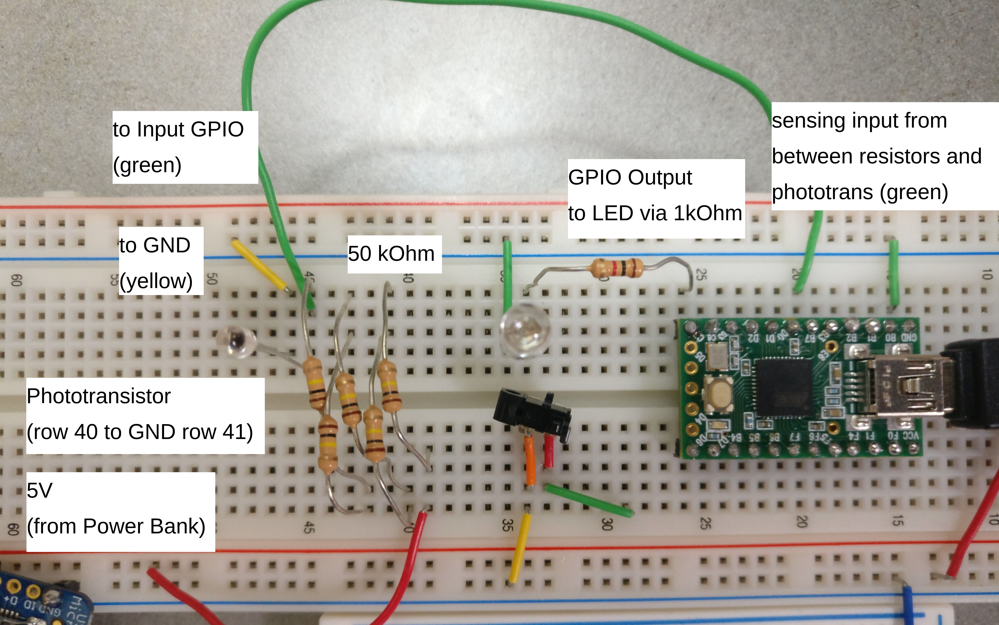

#### C Code

````c
#include "teensy_general.h"

#define CLOCK_SPEED 16e6
#define PRESCALAR 1024

int main(void){
    // set 1024 prescalar
    set(TCCR3B, CS32); set(TCCR3B, CS30);

    teensy_clockdivide(0); //set the clock speed

    clear(DDRB, 7); // B7 is input

    set(DDRC, 7);  // C7 is output
    clear(PORTC, 7); // no LED

    while(1){

        // detect if light
        if(bit_is_set(PINB, 7)){
            set(PORTC, 7);
        } else {
            clear(PORTC, 7);
        }
    }
}
````

#### [Video Demo of LED Phototransistor](https://www.youtube.com/watch?v=GB3uBvNIjmE)

### 2.2.2 Tuning Gain of Transistor

#### [Video Demo of Hand-Waiving](https://www.youtube.com/watch?v=TUO3oFkFpG4)

#### Schematic

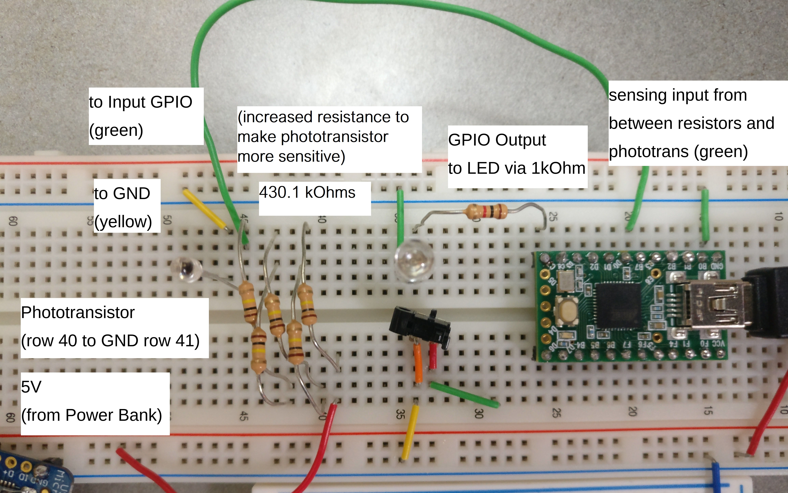

#### C Code

````c
#include "teensy_general.h"

#define CLOCK_SPEED 16e6
#define PRESCALAR 1024

int main(void){
    // set 1024 prescalar
    set(TCCR3B, CS32); set(TCCR3B, CS30);

    teensy_clockdivide(0); //set the clock speed

    clear(DDRB, 7); // B7 is input

    set(DDRC, 7);  // C7 is output
    clear(PORTC, 7); // no LED
    
    while(1){

        // detect if light
        if(bit_is_set(PINB, 7)){
            set(PORTC, 7);
        } else {
            clear(PORTC, 7);
        }
    }
}
````

## 2.3 Operational Amplifier

### 2.3.1 Drive IR LED

[From the LED Datasheet](https://optoelectronics.liteon.com/upload/download/DS-50-92-0015/LTE-4208.pdf)

|   |   |
|---|---|
| Vcc                               | 3.3V              |
| Desired I                         | 30mA              |
| Vforward                          | 1.2V              |
| LED Continuous Forward Current    | 50mA              |
| **R**                             | (Vcc-Vf) / I = 70 Ohms  |

If we use 100 Ohm resistor, I = (3.3-1.2)/100 = 21mA

### 2.3.2 Photo Detection Circuit

From [datasheet for OpAmp](https://ww1.microchip.com/downloads/en/DeviceDoc/20001669e.pdf)

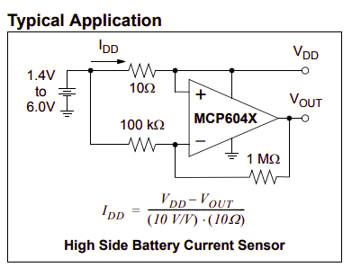

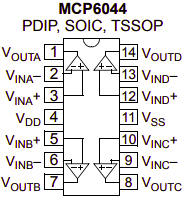

From [datasheet for Phototrans](https://www.mouser.com/datasheet/2/239/R4206-1141534.pdf)

**OpAmp Circuit Diagram**

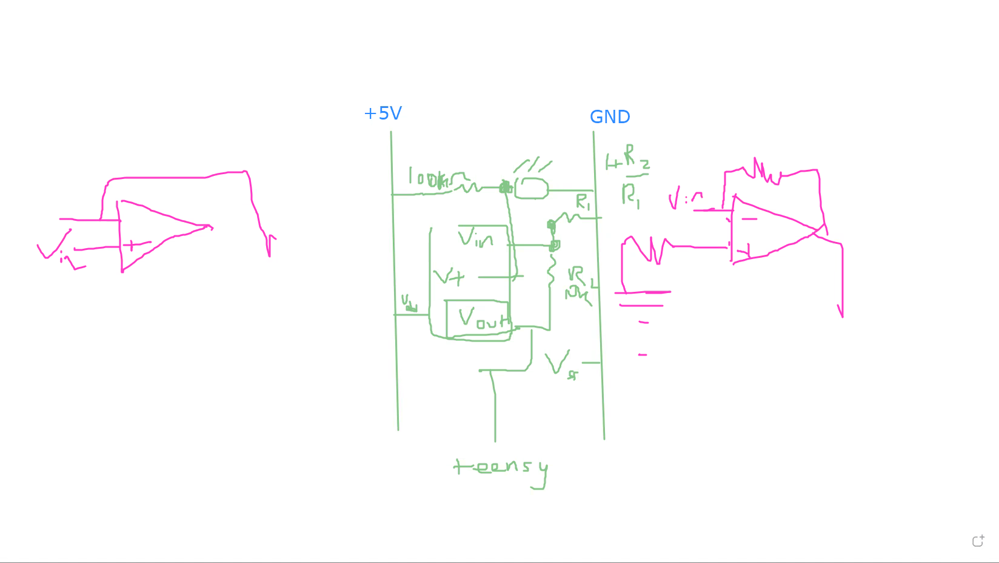


