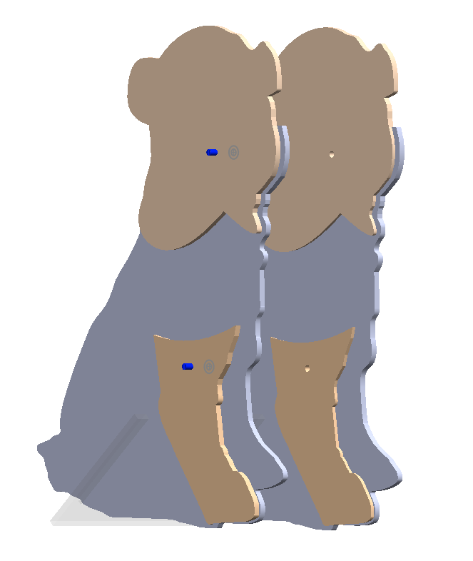
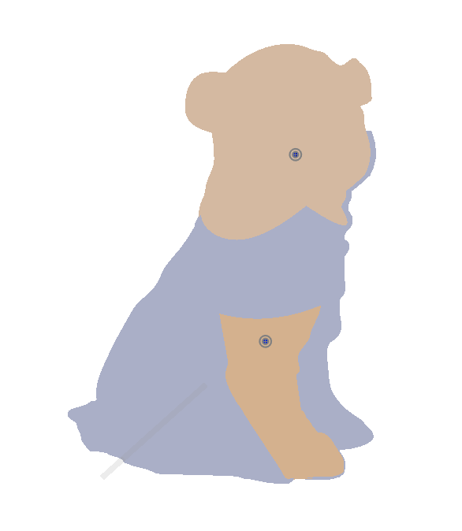
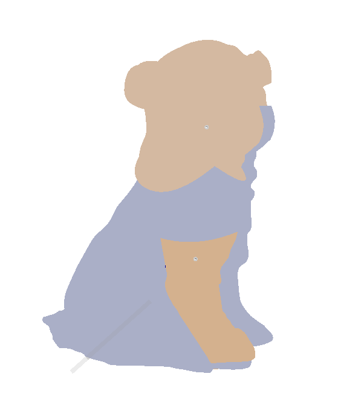

# Lab 3 - Waldo

Sheil Sarda <sheils@seas.upenn.edu>

## 3.2 Waldo Output

### 3.2.1 Drawing for Input and Output

**Input Waldo Design**

**Output Waldo Design**

**Dimensions** 

| | |
|-|-|
| Length | 8 inches |
| Width | 6.5 inches |
| | |

**Intented motion of moving parts**

On the Waldo Input robot, the paw and the head are free to rotate 
about the potentiometer. These actions will be replicated on the 
Waldo Output robot.

### 3.2.2 Circuit Diagram and Analysis

**Current ratings**

| Current source / draw | Worst Case |
|-|-|
| Power Supply |   |
| SG90 Servo |  |
| Teensy |  |
| Potentiometer |  |
| | |

**Total current draw in the worst case (teensy, potentiometers, servos)**
