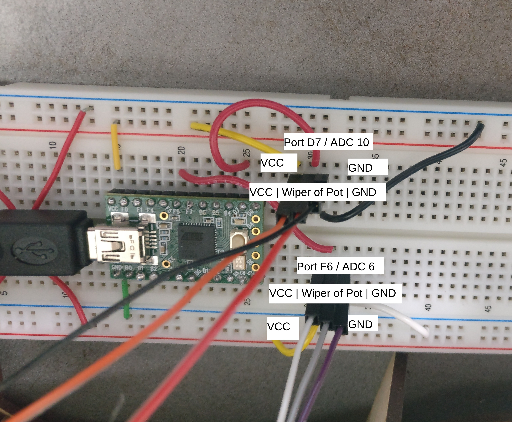
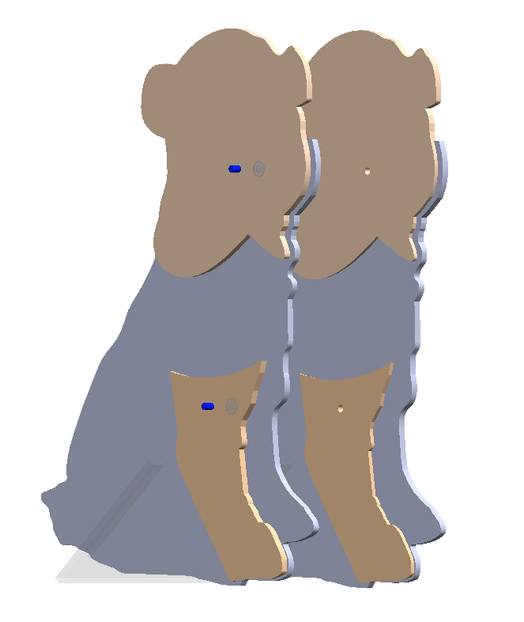
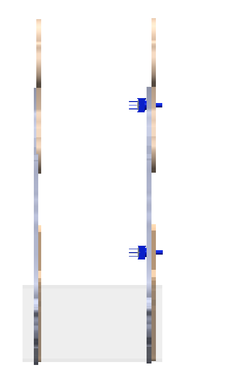
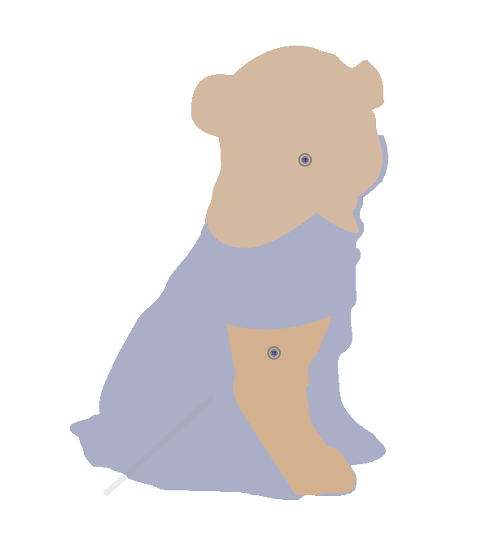
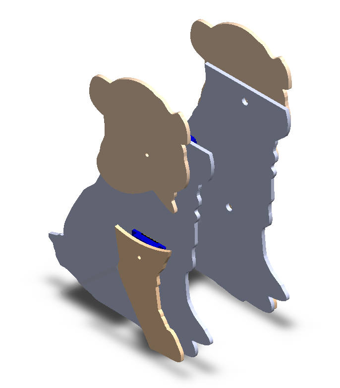
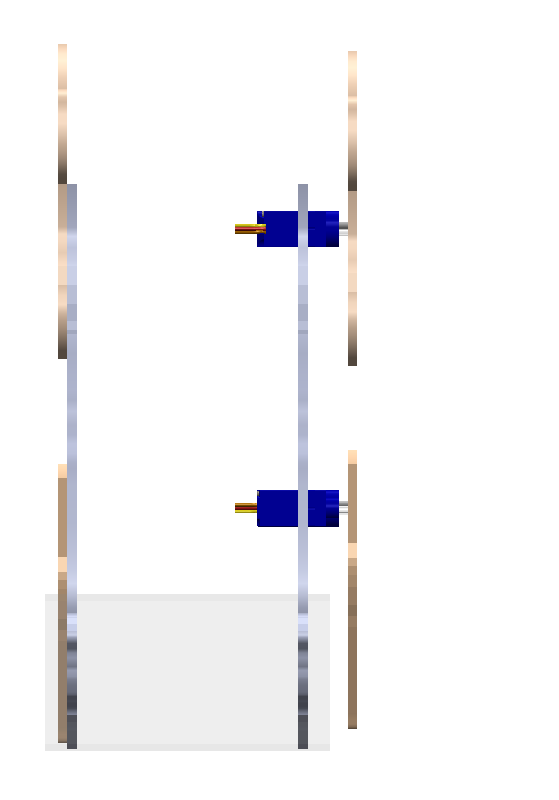
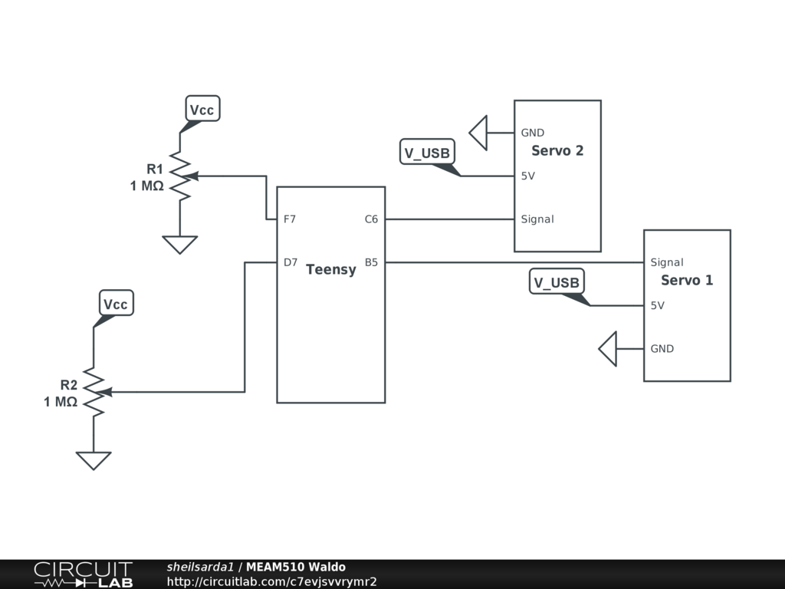

# Lab 3 - Waldo

Sheil Sarda <sheils@seas.upenn.edu>

## 3.1 Waldo Input

### 3.1.1 Build Plan and Fabrication

**Dims of dog for input**

| | |
|-|-|
| Length | 8 inches |
| Width | 6.5 inches |
| Potentiometer - fixed part | Radius: 0.125 inches |
| Potentiometer - rotating | Radius:  0.062 inches|
| | |

**Notes from check-off with Walter 2/19**

Since the servos we have to use for the actuation part of the assignment are quite tiny, may need to shrink the design for that part

**Electrical Components**

| Part | Quantity | In Kit |
|--|--|--|
| D-shaft potentiometers | 2 | Pick-up |
| Stem potentiometer (3310Y-001-103L-ND) | 2 | Have |
| SG90 Servo | 2 | Have |
| | |

### 3.1.2 ADC Subroutines

````C
#include "teensy_general.h"
#include "t_usb.h"
#include <stdbool.h>
#include <string.h>

#define CLOCK_SPEED 16e6
#define PRESCALAR 1024 // freq of 15.625kHz
#define TARGET 10e3
#define USB 1
#define MAX_ADC 1023
#define MAX_ANG 300

void setup_ADC(char adc_num){

    set(ADMUX, REFS0); // AVcc

    // 128 ADC prescalar
    set(ADCSRA, ADPS0); 
    set(ADCSRA, ADPS1); 
    set(ADCSRA, ADPS2); 

    switch(adc_num){ // Disable digital input
        case 0 : set(DIDR0, ADC0D);   break;
        case 1 : set(DIDR0, ADC1D);   break;
        case 4 : set(DIDR0, ADC4D);   break;
        case 5 : set(DIDR0, ADC5D);   break;
        case 6 : set(DIDR0, ADC6D);   break;
        case 7 : set(DIDR0, ADC7D);   break;
        case 8 : set(DIDR2, ADC8D);   break;
        case 9 : set(DIDR2, ADC9D);   break;
        case 10: set(DIDR2, ADC10D);  break;
        case 11: set(DIDR2, ADC11D);  break;
        case 12: set(DIDR2, ADC12D);  break;
        case 13: set(DIDR2, ADC13D);  break;
    }

    set(ADCSRA, ADEN); // enable ADC
    set(ADCSRA, ADSC); // first conversion
    
}

void setup_next(char adc_num){

    unsigned int mask1 = 
                        (1 << MUX0) | 
                        (1 << MUX1) | 
                        (1 << MUX2);

    ADMUX &= ~mask1;

    clear(ADCSRB, MUX5);

    switch(adc_num){
        case 0 :                        break;
        case 1 :    set(ADMUX, MUX0);   break;
        case 4 :    set(ADMUX, MUX2);   break;
        case 5 :    set(ADMUX, MUX2); 
                    set(ADMUX, MUX0);   break;
        case 6 :    set(ADMUX, MUX2);
                    set(ADMUX, MUX1);   break;
        case 7 :    set(ADMUX, MUX0);
                    set(ADMUX, MUX1);
                    set(ADMUX, MUX2);   break;
        case 8 :    set(ADCSRB, MUX5);  break;
        case 9 :    set(ADCSRB, MUX5);
                    set(ADMUX, MUX0);   break;
        case 10:    set(ADCSRB, MUX5);
                    set(ADMUX, MUX1);   break;
        case 11:    set(ADCSRB, MUX5);
                    set(ADMUX, MUX1);
                    set(ADMUX, MUX0);   break;
        case 12:    set(ADCSRB, MUX5);
                    set(ADMUX, MUX2);   break;
        case 13:    set(ADCSRB, MUX5);
                    set(ADMUX, MUX2);
                    set(ADMUX, MUX0);   break;
    }                    
    
}

int read_adc(char next_adc){
    
    set(ADCSRA, ADSC); // first conversion
    
    setup_next(next_adc);

    while(!bit_is_set(ADCSRA, ADIF)); 

    unsigned int result = ADC;

    set(ADCSRA, ADIF); // clear compute flag
    return result;
}

int main(void){
    #ifdef USB
        m_usb_init();
        while(!m_usb_isconnected());
    #endif

    // set 1024 prescalar
    set(TCCR3B, CS32); set(TCCR3B, CS30);
    teensy_clockdivide(0); //set the clock speed

    setup_ADC(10);  // ADC10 or PD7
    setup_ADC(6);   // ADC6 or PF6

    unsigned int result1, result2;

    while(1){

        if(TCNT3 < TARGET * PRESCALAR / CLOCK_SPEED) continue;

        TCNT3 = 0;

        result2 = read_adc(10); // gives you ADC6
        result1 = read_adc(6);  // gives you ADC10

        result2 *= ((float) MAX_ANG / MAX_ADC);
        result1 *= ((float) MAX_ANG / MAX_ADC);

        #ifdef USB
            m_usb_tx_string("LEFT: ");
            m_usb_tx_uint(result2); 
            m_usb_tx_string("  RIGHT: ");
            m_usb_tx_uint(result1); 
            m_usb_tx_string("\r\n");
        #endif
    }
}
````

#### [Video of Waldo Input](https://www.youtube.com/watch?v=K561onxc1ng) 

#### Circuit Diagram



#### Sensitivity

**Range of Motion**

The head of the dog is free to rotate in both the CCW and CW directions. Hence, it's resting state value is 150 degrees, and it can go to both the minimum (0 degrees) and maximum (300 degrees).

The paw of the dog is free to rotate only in the CW direction. Hence, it's resting value is 0 degrees, and it can go to the maximum (300 degrees), given there are no obstructions.


**Noise Sources**

Potential sources of noise in the ADC values would be loose wiring connections between the potentiometer and the Teensy, as well as gravity sliding the mechanical components, causing the potentiometer to change resistances.

## 3.2 Waldo Output

### 3.2.1 Drawing for Input and Output

**Input Waldo Design**





**Output Waldo Design**





**Dimensions** 

| | |
|-|-|
| Length | 8 inches |
| Width | 6.5 inches |
| | |

**Intented motion of moving parts**

On the Waldo Input robot, the paw and the head are free to rotate 
about the potentiometer. These actions will be replicated on the 
Waldo Output robot.

### 3.2.2 Circuit Diagram and Analysis



**Current ratings: Output**

| Current source / draw | Worst Case |
|-|-|
| BestOn Power Supply (Source) |  2100mA |
| [SG90 Servo  (Load)](https://uc18cb49961d9f77f45f7cebf5c2.dl.dropboxusercontent.com/cd/0/inline2/BKZRxTjTvypxBrcIc-Bc7b9uYd8iAoMEf6NoLhIHY-y74kQL4_WI61Hdltj095YQOTABkssT9Pr7AsIxupaZ6kbYDN21gOg560FfxXQWhwfjiiB9deJJBtocc5ZnOI56G8BOwwVKPrLhO3OBTUTo4DTiQSP68gejUl5tdvCBSJk9N2pnTVzF_w0ja2Z7qrgvIYiiXmQT0PCOuVHXR3rGk450vOtwW6wfzl9Hi_oohn_rVxJPUJjROQpc413eP9ZNWIMpAu3zf43x4dQ0Wvo5nDNCFs__xBdkXDI_GS4E1XeGeDpSqpVaDZrHxnNInfMtCfUPaGlNgs3S4LcV_74Kov08XyDDXSne85SFW_M-yIEt_Q/file#) | 700mA |

Datasheets for SG90 Servo and Additional References):
- [Servo Internal Circuitry](https://www.princeton.edu/~mae412/TEXT/NTRAK2002/292-302.pdf)
- [Using SG90 with an Arduino](https://www.auselectronicsdirect.com.au/assets/brochures/TA0132.pdf)
- [SG90 Datasheet and wiring diagram](http://www.handsontec.com/dataspecs/SG90-Servo.pdf)

**Current ratings: Input**

| Current source / draw | Worst Case |
|-|-|
| Teensy via USB 2.0 (Source) | 500mA |
| Potentiometer (Load) | I = V/R = 3.3V / 1kOhm = 3.3mA |
| | |

**Total current draw in the worst case (teensy, potentiometers, servos)**

In the worst case on the Output side, as described above, the SG90 servo powered by 
the BestOn power bank will be able to handle the current draw.

On the Input side, the Teensy will also be able to power the potentiometer in the
worst case.

### 3.2.3 Circuit Diagram and Analysis

Code submitted on Canvas submission. Also included here for reference:

````c
/* Name: main.c
 * Author: Sheil Sarda
 */
#include "teensy_general.h"
#include "t_usb.h"
#include <stdbool.h>
#include <string.h>
#include <math.h>

#define CLOCK_SPEED 16e6
#define PRESCALAR 256

#define TARGET 10e3
#define USB 1
#define MAX_ADC 1023
#define MAX_ANG 300

#define FREQ_HZ    50    // variable for frequency
#define DUTY_CYCLE 0.08    // duty cycle
#define MAX_DUTY 0.111
#define MIN_DUTY 0.055

#define PAW_MIN 60.0
#define PAW_MAX 200.0

#define HEAD_MIN 40.0
#define HEAD_MAX 230.0

void setup_ADC(char adc_num){

    set(ADMUX, REFS0); // AVcc

    // 128 ADC prescalar
    set(ADCSRA, ADPS0); 
    set(ADCSRA, ADPS1); 
    set(ADCSRA, ADPS2); 

    switch(adc_num){ // Disable digital input
        case 0 : set(DIDR0, ADC0D);   break;
        case 1 : set(DIDR0, ADC1D);   break;
        case 4 : set(DIDR0, ADC4D);   break;
        case 5 : set(DIDR0, ADC5D);   break;
        case 6 : set(DIDR0, ADC6D);   break;
        case 7 : set(DIDR0, ADC7D);   break;
        case 8 : set(DIDR2, ADC8D);   break;
        case 9 : set(DIDR2, ADC9D);   break;
        case 10: set(DIDR2, ADC10D);  break;
        case 11: set(DIDR2, ADC11D);  break;
        case 12: set(DIDR2, ADC12D);  break;
        case 13: set(DIDR2, ADC13D);  break;
    }

    set(ADCSRA, ADEN); // enable ADC
    set(ADCSRA, ADSC); // first conversion
    
}

void setup_next(char adc_num){

    unsigned int mask1 = 
                        (1 << MUX0) | 
                        (1 << MUX1) | 
                        (1 << MUX2);

    ADMUX &= ~mask1;

    clear(ADCSRB, MUX5);

    switch(adc_num){
        case 0 :                        break;
        case 1 :    set(ADMUX, MUX0);   break;
        case 4 :    set(ADMUX, MUX2);   break;
        case 5 :    set(ADMUX, MUX2); 
                    set(ADMUX, MUX0);   break;
        case 6 :    set(ADMUX, MUX2);
                    set(ADMUX, MUX1);   break;
        case 7 :    set(ADMUX, MUX0);
                    set(ADMUX, MUX1);
                    set(ADMUX, MUX2);   break;
        case 8 :    set(ADCSRB, MUX5);  break;
        case 9 :    set(ADCSRB, MUX5);
                    set(ADMUX, MUX0);   break;
        case 10:    set(ADCSRB, MUX5);
                    set(ADMUX, MUX1);   break;
        case 11:    set(ADCSRB, MUX5);
                    set(ADMUX, MUX1);
                    set(ADMUX, MUX0);   break;
        case 12:    set(ADCSRB, MUX5);
                    set(ADMUX, MUX2);   break;
        case 13:    set(ADCSRB, MUX5);
                    set(ADMUX, MUX2);
                    set(ADMUX, MUX0);   break;
    }                    
    
}

int read_adc(char next_adc){
    
    set(ADCSRA, ADSC); // first conversion
    
    setup_next(next_adc);

    while(!bit_is_set(ADCSRA, ADIF)); 

    unsigned int result = ADC;

    set(ADCSRA, ADIF); // clear compute flag
    return result;
}

void setup_PWM(float duty, char timer){

    switch(timer){
        case 1: 
            set(DDRB, 5); // output compare

            // (mode 14) up to ICR1, PWM
            set(TCCR1B, WGM13);
            set(TCCR1B, WGM12);
            set(TCCR1A, WGM11);

            set(TCCR1A, COM1A1); // clear OC

            ICR1 = CLOCK_SPEED/(FREQ_HZ * PRESCALAR);
            OCR1A = ICR1 * duty;
            break;

        case 3:
            set(DDRC, 6);

            set(TCCR3B, WGM33);
            set(TCCR3B, WGM32);
            set(TCCR3A, WGM31);

            set(TCCR3A, COM3A1);
            ICR3 = CLOCK_SPEED/(FREQ_HZ * PRESCALAR);

            OCR3A = ICR3 * duty;
            break;
    }
}

void change_PWM(float duty, char timer){
    switch(timer){
        case 1: OCR1A = ICR1 * duty;
                break;
        case 3: OCR3A = ICR3 * duty;
                break;
    }
}

int main(void){
    teensy_clockdivide(0); //set the clock speed
    #ifdef USB
        m_usb_init();
        while(!m_usb_isconnected());
    #endif

    // set 256 prescalar  - Servo PWM
    set(TCCR3B, CS32);
    setup_PWM(DUTY_CYCLE, 3);
    
    // set 256 prescalar  - Servo PWM
    set(TCCR1B, CS12);
    setup_PWM(DUTY_CYCLE, 1);

    setup_ADC(10);  // ADC10 or PD7
    setup_ADC(6);   // ADC6 or PF6

    unsigned int result1, result2;
    float duty1, duty2;

    while(1){

        result2 = read_adc(10); // gives you ADC6
        result1 = read_adc(6);  // gives you ADC10

        result2 *= ((float) MAX_ANG / MAX_ADC);
        result1 *= ((float) MAX_ANG / MAX_ADC);

        duty1   = ((float) fmax(result1 - HEAD_MIN, 0.0));
        duty1   = ((float) (duty1*(MAX_DUTY - MIN_DUTY)/HEAD_MAX) + MIN_DUTY);

        duty2   = ((float) fmax(result2 - PAW_MIN, 0.0));
        duty2   = ((float) (duty2*(MAX_DUTY - MIN_DUTY)/PAW_MAX) + MIN_DUTY);

        // need to flip paw
        duty2   = MAX_DUTY - duty2;
        
        change_PWM(duty1, 3);
        change_PWM(duty2, 1);

        #ifdef USB
            m_usb_tx_string("LEFT: ");
            m_usb_tx_uint(result2);
            m_usb_tx_string(" duty: ");
            m_usb_tx_uint(duty2*100); 

            m_usb_tx_string("  RIGHT: ");
            m_usb_tx_uint(result1); 
            m_usb_tx_string(" duty: ");
            m_usb_tx_uint(duty1*100); 
            m_usb_tx_string("\r\n");
        #endif
    }
}
````

### [3.2.4 Dance Video](https://www.youtube.com/watch?v=2EWuCiyF0zQ)
