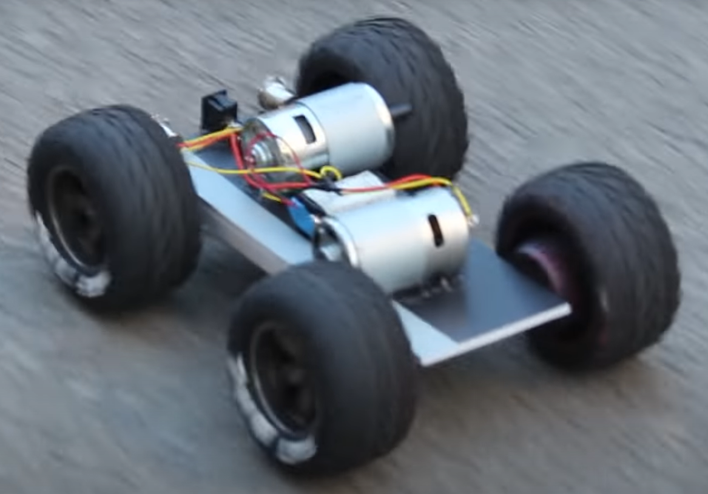
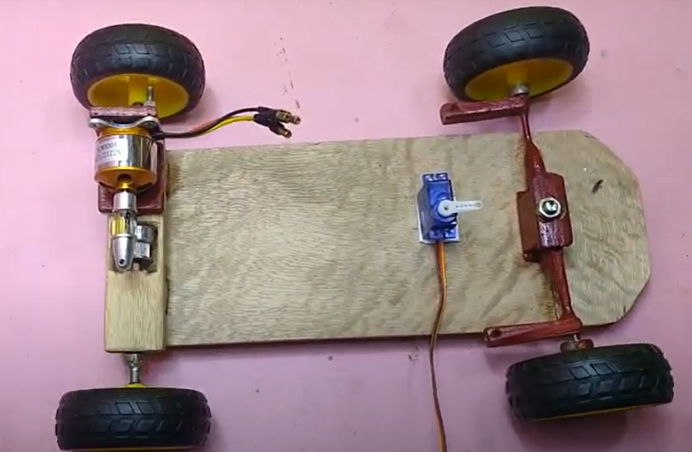
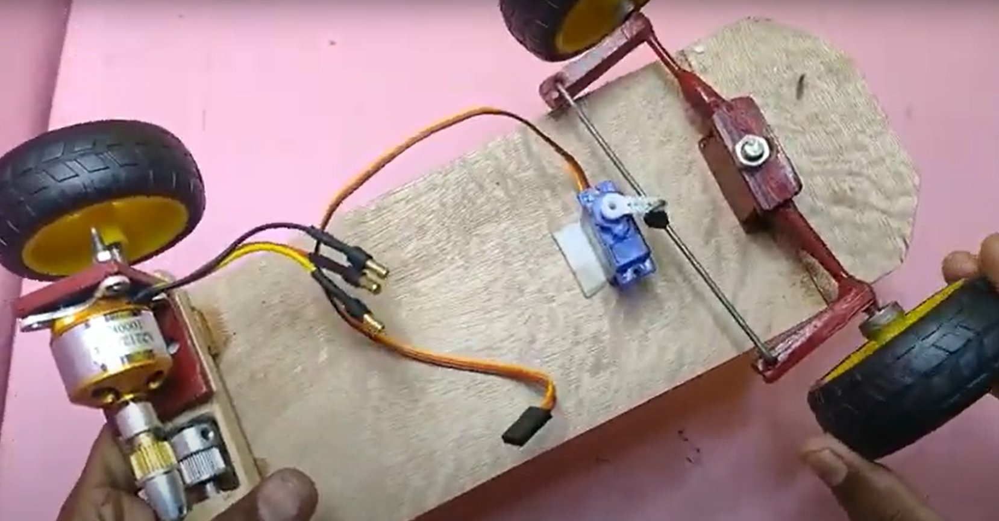
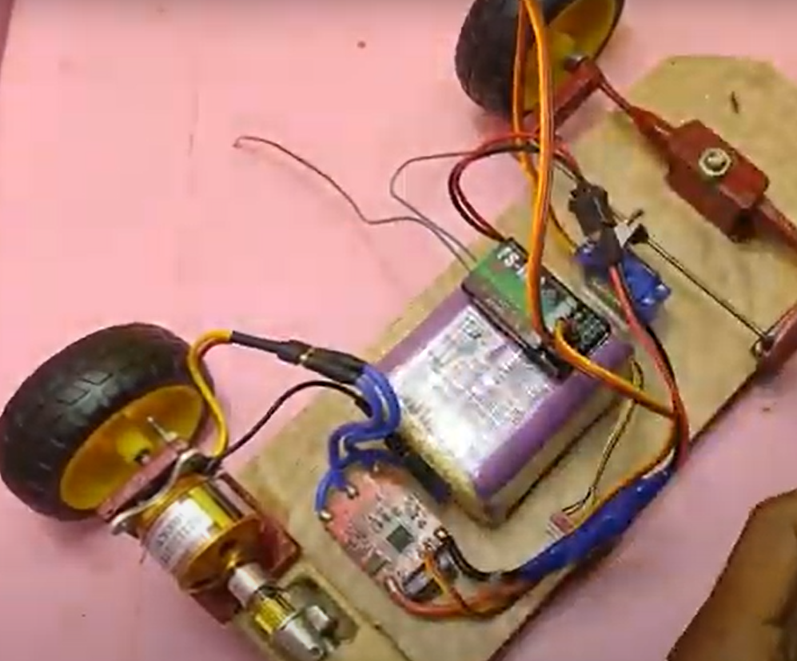
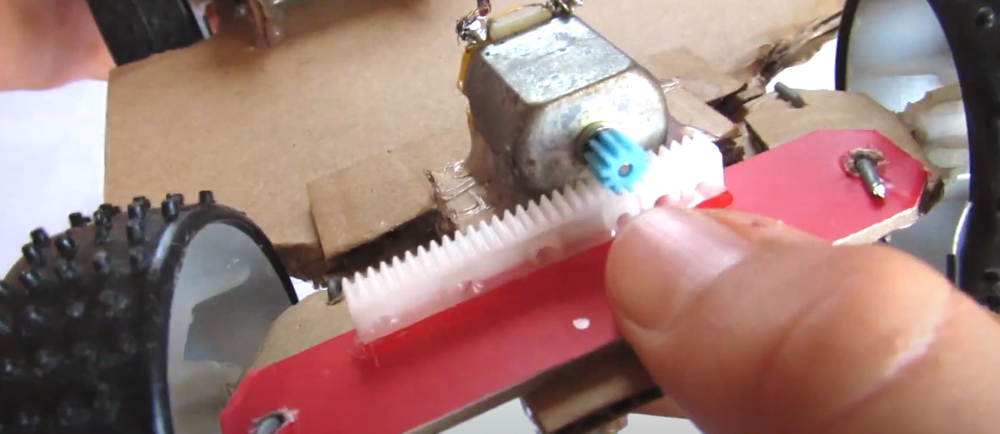

# Research different types of mobile bases:

1. holonomic drives
1. differential drives
    1. [AWD vs 4WD](https://www.youtube.com/watch?v=rHMDtEPeuQM&ab_channel=WonderWorld)
    1. [MEAM510 Car Demo](https://www.youtube.com/watch?v=fsVbaADWTgg)
    1. [4 DC Motor + Servo RC Car build](https://www.youtube.com/watch?v=NtPyDhM1dF0&ab_channel=EliteWorm)
    1. [RC Car with power in opposite wheels](https://www.youtube.com/watch?v=vRmBVLQngJ8&ab_channel=DattaBenurCreation)

    

    1. [RC Car with Servo and DC Motor](https://www.youtube.com/watch?v=jjZU6sNkEV8&ab_channel=MOCreative)

    
    
    

    1. [Straight Gear Rack Steering](https://www.youtube.com/watch?v=ZdtPTUsrAA4&ab_channel=MaxImagination)

    

1. tank-steering drives
    1. [Wikipedia](https://en.wikipedia.org/wiki/Tank_steering_systems)

If you choose to use different motors, be careful about the power
capability of the battery and the limits of the motor drivers.
