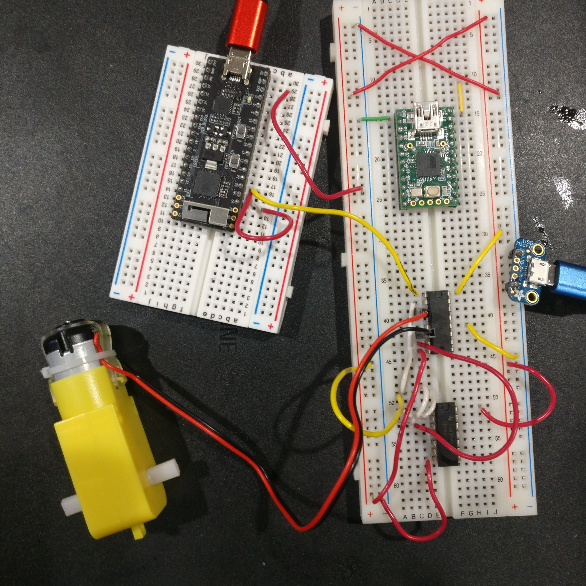

# Lab 4 - Mobility

Sheil Sarda <sheils@seas.upenn.edu>

## 4.1 Fabrication and Motor Driving

### 4.1.1 Driving Motors

#### Setup the H-Bridge motor driver SN754420 to drive one of the supplied yellow motors

*Refer to Slide 51 of Lecture 14*

1. Optionally, use the FAN8100
1. Power the motor using the Beston battery

#### Use a NAND chip 74HC00 in your kit to make an inverter

*Refer to Lecture 04*

1. Use this inverter so you need only one I/O line to set the direction of the motor
	1. the I/O line drives 1A and the input to the inverter, so the output of the
		inverter drives 2A
    1. To use a NAND gate as an inverter, connect the signal to both inputs and use
        the output as the inverted signal
1. Set up the OscilloSorta to drive the enable pin with PWM and control the
direction of the motor by switching voltages manually
	1. optionally connect a switch and pullup resistor
    1. Use 50Hz with 0% to 100% duty cycle to change velocity of motor
1. Demonstrate the motor changing speeds with varying PWM and different directions
with different speeds.
1. Show a TA for check off.
	1. if preferred, you may submit a video, but in the video show your face before
		demonstrating.
1. Submit a photo of your
circuit where the lines and motor are visible.

### 4.1.2 Car Architecture

#### Research different types of mobile bases:

1. holonomic drives
1. differential drives
1. tank-steering drives

If you choose to use different motors, be careful about the power
capability of the battery and the limits of the motor drivers.

#### Discuss with your TA/coach about your design.

1. Have a completed draft CAD assembly of your car ready to be reviewed
by teaching staff in lecture on Monday 3/15.
1. Be ready to create and submit `.dwg` files if your
TA/coach approves your design.
1. Drafts should be near complete so the TA’s can judge how
they assemble.
1. Be sure to follow the laser-cutting guidelines (reproduced below for your
convenience).
1. ​Submit drafts to canvas.
