# Lab 4 - Mobility

Sheil Sarda <sheils@seas.upenn.edu>

## 4.1 Fabrication and Motor Driving

### 4.1.1 Driving Motors

#### Setup the H-Bridge motor driver SN754420 to drive one of the supplied yellow motors

*Refer to Slide 51 of Lecture 14*

1. Optionally, use the FAN8100
1. Power the motor using the Beston battery

#### Use a NAND chip 74HC00 in your kit to make an inverter

*Refer to Lecture 04*

1. Use this inverter so you need only one I/O line to set the direction of the motor
  1. the I/O line drives 1A and the input to the inverter, so the output of the
    inverter drives 2A
  1. To use a NAND gate as an inverter, connect the signal to both inputs and use
  the output as the inverted signal
1. Set up the OscilloSorta to drive the enable pin with PWM and control the
direction of the motor by switching voltages manually
  1. optionally connect a switch and pullup resistor
  1. Use 50Hz with 0% to 100% duty cycle to change velocity of motor
1. Demonstrate the motor changing speeds with varying PWM and different directions
with different speeds.
1. Show a TA for check off.
1. Submit a photo of your
circuit where the lines and motor are visible.

### 4.1.2 Car Architecture

**Motor Dimensions**

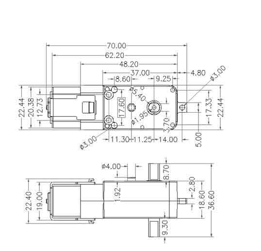

#### Discuss with your TA/coach about your design.

1. Have a completed draft CAD assembly of your car ready to be reviewed
by teaching staff in lecture on Monday 3/15.
1. Be ready to create and submit `.dwg` files if your
TA/coach approves your design.
1. Drafts should be near complete so the TA’s can judge how
they assemble.
1. Be sure to follow the laser-cutting guidelines (reproduced below for your
convenience).
1. ​Submit drafts to canvas.

**Draft 1**

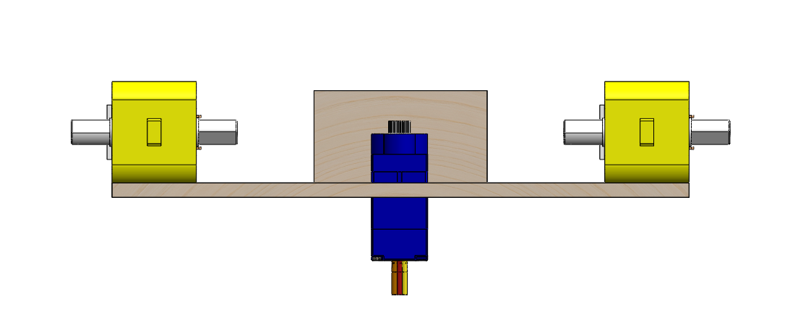
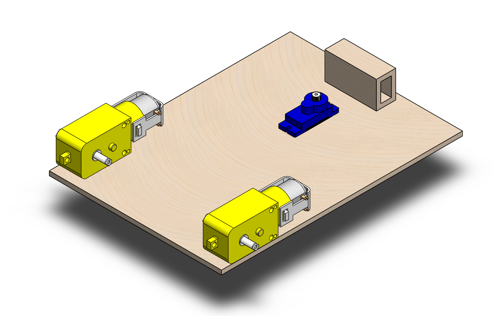
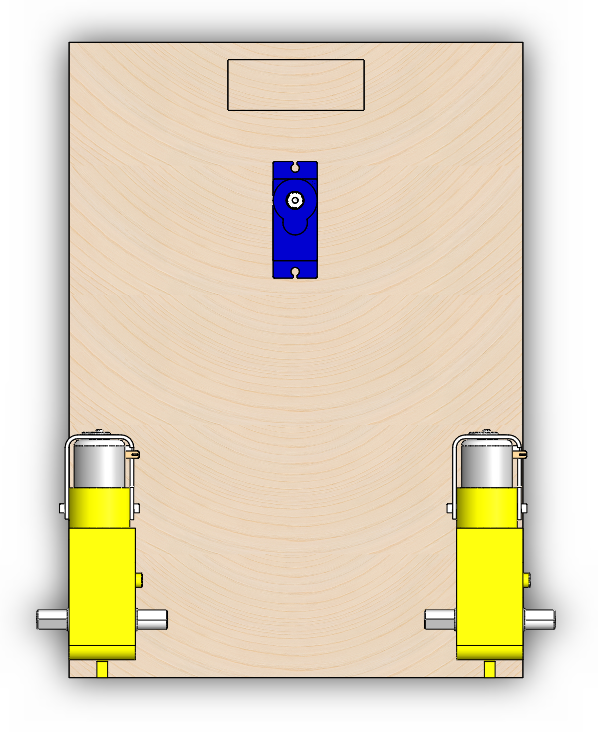

**Draft 4**

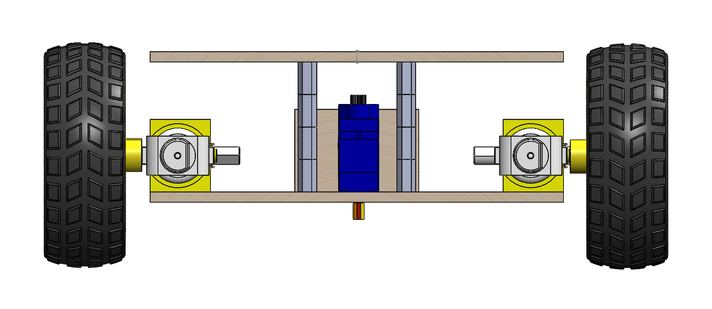
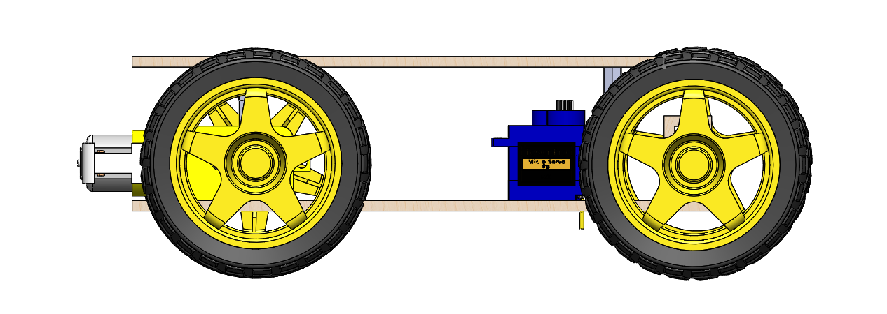
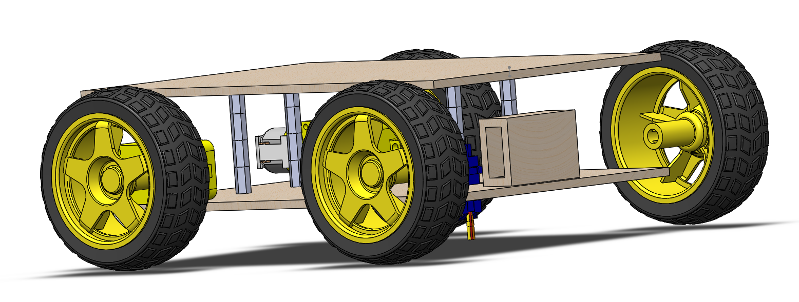

Accompanying BoM

| Part | Quantity | Purchase Link | Unit Cost |
|--|--|--|--|
| Wheel | 4 |  [Adafruit](https://www.adafruit.com/product/3766) | 1.50 * 4  = 6 |
| 2202K-ND	4-40, FF, 3/8” | 16 |  Ministore | 0.25 * 16  = 4 |
| 2mm x 150mm Shaft Rods | Pack of 10 | [Amazon](https://www.amazon.com/dp/B08L7RKM6Q/ref=sspa_dk_detail_2?psc=1&pd_rd_i=B08L7RKM6Q&pd_rd_w=wEA41&pf_rd_p=4269e1a0-a218-4fbd-9748-1cd337d2f2a5&pd_rd_wg=uFgos&pf_rd_r=BFQDQB23PGNKYHZQ01AS&pd_rd_r=23096bd3-fa24-43a9-9b10-48d4cfbe4484&spLa=ZW5jcnlwdGVkUXVhbGlmaWVyPUEzTzA2TjZVVlFPTDdaJmVuY3J5cHRlZElkPUEwMTc5NDQ4M1VWODgxUUVIMk1HVSZlbmNyeXB0ZWRBZElkPUEwNzU1OTA0M0QxQjBHWEdPT01ZTyZ3aWRnZXROYW1lPXNwX2RldGFpbCZhY3Rpb249Y2xpY2tSZWRpcmVjdCZkb05vdExvZ0NsaWNrPXRydWU=) | 6.99 |
| | | |

**Feedback from Walker on Monday 3/15**

- Ackerman Steering
    - Servo Motor is too weak to steer
    - Current Design puts all the load of the front axel on the Servo horn
        which it cannot support, so would need to add additional support arms
        that are free to rotate and mounted to the top of the rectangular box
    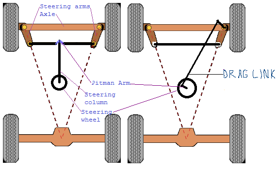
- Rack and Pinon Steering: would need to have a DC Motor with feedback to be able to turn accurately, and also create guards on the flat gear to limit the turning radius     
    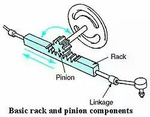
- 3-wheeled robot
    - [Scrap the front-wheel system and use a caster-wheel instead](https://www.amazon.com/Slipstick-CB681-Protector-Mounting-Options/dp/B010SLSK48/ref=sr_1_38?dchild=1&keywords=caster+wheel+rc+car&qid=1615833262&sr=8-38)
    - [Ball caster wheel](https://www.adafruit.com/product/1200); [Caster wheels](https://www.mcmaster.com/standard-casters/caster-type~swivel/capacity-per-caster-1~range~~-11485816462551/brake-lock-type~wheel-brake/plate-casters-7/light-duty-furniture-casters-with-nylon-wheels/) are discouraged

**General Advice**

- [Use a D-Shaft Adapter to extend DC Motor shaft](https://www.zoro.com/dayton-motor-shaft-adapter-14-20-dia-x-14-od-1-l-4x098/i/G2419112/)
- No point in saving more than 1/2 of the $75 allocation for the final project; try DC Motors with encoders
- Add mounting points for DC Motors, Perfboard and ESP32
- Make channels for cable-management

**Final Version**

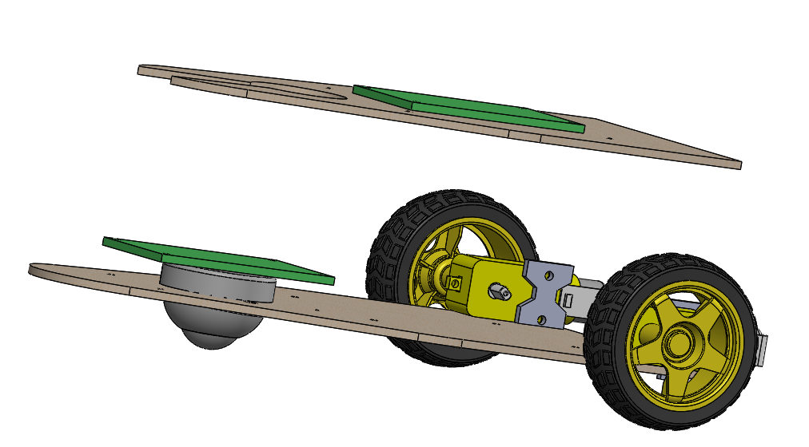
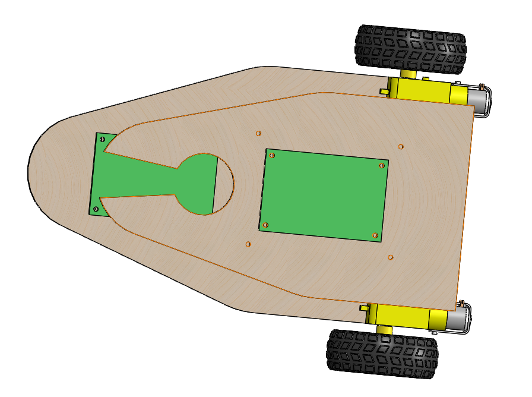

Accompanying BoM

| Part | Quantity | Purchase Link | Unit Cost |
|--|--|--|--|
|Recessed Flange-Mount Ball Transfer, 1" Diameter Steel Ball | 1 | [McMaster Carr](https://www.mcmaster.com/2415T33/) | 6.27 |
| Wheel         | 2 |  [Adafruit](https://www.adafruit.com/product/3766) | 1.50 * 2  = 3 |
|N20 DC Motor with Magnetic Encoder - 6V with 1:50 Gear Ratio | 1 | [Adafruit](https://www.adafruit.com/product/4638#description) | 12.50 |
| ESP-32        | 1 |  Ministore |  |
| Protoboards   | 2 |  Ministore |  |
| | | |
