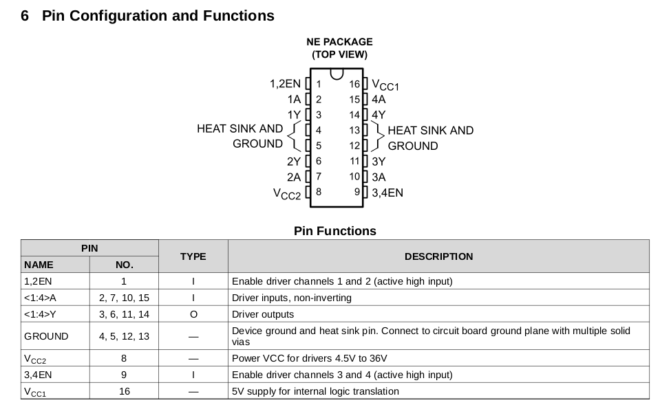
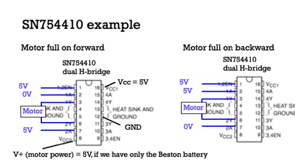
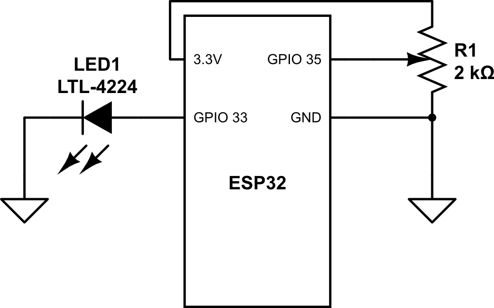
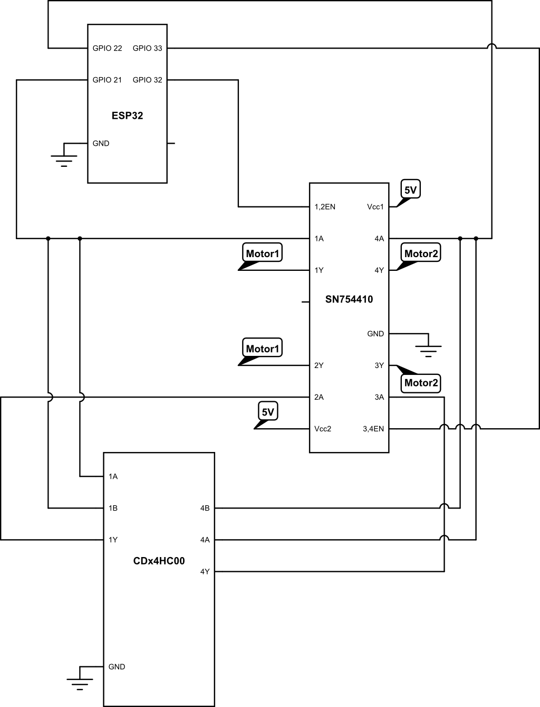

# Lab 4 - Mobility

Sheil Sarda <sheils@seas.upenn.edu>

## 4.1 Fabrication and Motor Driving

### 4.1.1 Driving Motors

#### Setup the H-Bridge motor driver SN754420 to drive one of the supplied yellow motors

*Refer to Slide 51 of Lecture 14*

1. Optionally, use the FAN8100
1. Power the motor using the Beston battery

#### Use a NAND chip 74HC00 in your kit to make an inverter

*Refer to Lecture 04*

1. Use this inverter so you need only one I/O line to set the direction of the motor
  1. the I/O line drives 1A and the input to the inverter, so the output of the
    inverter drives 2A
  1. To use a NAND gate as an inverter, connect the signal to both inputs and use
  the output as the inverted signal
1. Set up the OscilloSorta to drive the enable pin with PWM and control the
direction of the motor by switching voltages manually
  1. optionally connect a switch and pullup resistor
  1. Use 50Hz with 0% to 100% duty cycle to change velocity of motor
1. Demonstrate the motor changing speeds with varying PWM and different directions
with different speeds.
1. Show a TA for check off.
1. Submit a photo of your
circuit where the lines and motor are visible.





### 4.1.2 Car Architecture

**Motor Dimensions**


#### Discuss with your TA/coach about your design.

1. Have a completed draft CAD assembly of your car ready to be reviewed
by teaching staff in lecture on Monday 3/15.
1. Be ready to create and submit `.dwg` files if your
TA/coach approves your design.
1. Drafts should be near complete so the TA’s can judge how
they assemble.
1. Be sure to follow the laser-cutting guidelines (reproduced below for your
convenience).
1. ​Submit drafts to canvas.

**Draft 1**


**Draft 4**


Accompanying BoM

| Part | Quantity | Purchase Link | Unit Cost |
|--|--|--|--|
| Wheel | 4 |  [Adafruit](https://www.adafruit.com/product/3766) | 1.50 * 4  = 6 |
| 2202K-ND	4-40, FF, 3/8” | 16 |  Ministore | 0.25 * 16  = 4 |
| 2mm x 150mm Shaft Rods | Pack of 10 | [Amazon](https://www.amazon.com/dp/B08L7RKM6Q/ref=sspa_dk_detail_2?psc=1&pd_rd_i=B08L7RKM6Q&pd_rd_w=wEA41&pf_rd_p=4269e1a0-a218-4fbd-9748-1cd337d2f2a5&pd_rd_wg=uFgos&pf_rd_r=BFQDQB23PGNKYHZQ01AS&pd_rd_r=23096bd3-fa24-43a9-9b10-48d4cfbe4484&spLa=ZW5jcnlwdGVkUXVhbGlmaWVyPUEzTzA2TjZVVlFPTDdaJmVuY3J5cHRlZElkPUEwMTc5NDQ4M1VWODgxUUVIMk1HVSZlbmNyeXB0ZWRBZElkPUEwNzU1OTA0M0QxQjBHWEdPT01ZTyZ3aWRnZXROYW1lPXNwX2RldGFpbCZhY3Rpb249Y2xpY2tSZWRpcmVjdCZkb05vdExvZ0NsaWNrPXRydWU=) | 6.99 |
| | | |

**Feedback from Walker on Monday 3/15**

- Ackerman Steering
    - Servo Motor is too weak to steer
    - Current Design puts all the load of the front axel on the Servo horn
        which it cannot support, so would need to add additional support arms
        that are free to rotate and mounted to the top of the rectangular box
    
- Rack and Pinon Steering: would need to have a DC Motor with feedback to be able to turn accurately, and also create guards on the flat gear to limit the turning radius     
    
- 3-wheeled robot
    - [Scrap the front-wheel system and use a caster-wheel instead](https://www.amazon.com/Slipstick-CB681-Protector-Mounting-Options/dp/B010SLSK48/ref=sr_1_38?dchild=1&keywords=caster+wheel+rc+car&qid=1615833262&sr=8-38)
    - [Ball caster wheel](https://www.adafruit.com/product/1200); [Caster wheels](https://www.mcmaster.com/standard-casters/caster-type~swivel/capacity-per-caster-1~range~~-11485816462551/brake-lock-type~wheel-brake/plate-casters-7/light-duty-furniture-casters-with-nylon-wheels/) are discouraged

**General Advice**

- [Use a D-Shaft Adapter to extend DC Motor shaft](https://www.zoro.com/dayton-motor-shaft-adapter-14-20-dia-x-14-od-1-l-4x098/i/G2419112/)
- No point in saving more than 1/2 of the $75 allocation for the final project; try DC Motors with encoders
- Add mounting points for DC Motors, Perfboard and ESP32
- Make channels for cable-management

**Final Version**


Accompanying BoM

| Part | Quantity | Purchase Link | Unit Cost |
|--|--|--|--|
|Recessed Flange-Mount Ball Transfer, 1" Diameter Steel Ball | 1 | [McMaster Carr](https://www.mcmaster.com/2415T33/) | 6.27 |
| Wheel         | 2 |  [Adafruit](https://www.adafruit.com/product/3766) | 1.50 * 2  = 3 |
|N20 DC Motor with Magnetic Encoder - 6V with 1:50 Gear Ratio | 1 | [Adafruit](https://www.adafruit.com/product/4638#description) | 12.50 |
| ESP-32        | 1 |  Ministore |  |
| Protoboards   | 2 |  Ministore |  |
| | | |


## Lab 4.2

### 4.2.1 Toggling LED

````cpp
// Blink LED with variable frequency 

const int ledPin1 = 21;
const int ledPin2 = 10;

// setting PWM properties
const int freq = 4000;
const int ledChannel = 0;
const int resolution = 8;

int val = 0;  // variable to store the value read
int dutyCycle = 255;

void setup(){
  analogReadResolution(10);
  pinMode(4, INPUT);
  Serial.begin(115200);

  // configure LED PWM functionalitites
  ledcSetup(ledChannel, freq, resolution);

  // attach the channel to the GPIO to be controlled
  ledcAttachPin(ledPin1, ledChannel);
  ledcAttachPin(ledPin2, ledChannel);
}

void loop(){
  Serial.println(String(dutyCycle));
  delay(100);

  val       = analogRead(4);
  dutyCycle = 255*((float) val/1024.0);
  ledcWrite(ledChannel, dutyCycle);
}
````

### 4.2.2 Using `ledc`


Circuit Diagram, video and website displayed in the next step.

### 4.2.3 Website displaying duty cycle

[**Dashboard**:](http://192.168.1.6/) `192.168.1.6`

**Circuit Diagram**



[Youtube Demo](https://www.youtube.com/watch?v=jmKuKUgpPbg): https://www.youtube.com/watch?v=jmKuKUgpPbg

````c
/*
   Sheil Sarda
   University of Pennsylvania
   copyright (c) 2021 All Rights Reserved
*/

#include <WiFi.h>
#include "html510.h"

#define BLINK_LED   33  // variable duty
#define POT_PIN     35   // potentiometer

// setting PWM properties
const int freq = 10;
const int ledChannel = 1;
const int resolution = 8;

int val = 0;            // read in pot
int dutyCycle = 255;    // start at 100%

WiFiServer server(80);

const char body[] PROGMEM = R"===(
<!DOCTYPE html>
<html><body>
<H1>
<a href="/H">Turn ON</a> LED.<br>
<a href="/L">Turn OFF</a> LED.<br>
<span id="freqlabel"> LED State HERE </span> <br>

</H1>
<button type="button" onclick="hit()"> Turn ON then OFF </button>
</body>
<script>
function hit() {
  var xhttp = new XMLHttpRequest();
  xhttp.open("GET", "hit", true);
  xhttp.send();
}  

setInterval(updateLabel,400);

function updateLabel() {
  var xhttp = new XMLHttpRequest();
  xhttp.onreadystatechange = function() {
    if (this.readyState == 4 && this.status == 200) {
      document.getElementById("freqlabel").innerHTML =   
             this.responseText;
    }
  };
  xhttp.open("GET", "LEDstate", true);
  xhttp.send();
}

</script>

</html>
)===";

/* web handler   */
void handleRoot(){
  sendhtml(body);
}

void handleH(){
  sendhtml(body);
}                    
                     
void handleL(){
  sendhtml(body);
}

void handleHit(){
  sendplain(""); // acknowledge         
}

void handleLEDstate(){
  String    s = "Frequency is " + String(freq) + "<br>";
            s += "Duty Cycle is ";
            s += String(dutyCycle*100/254);
            s += "% <br>";
  sendplain(s);
}


void setup() {
  Serial.begin(115200);                                             
  WiFi.mode(WIFI_MODE_STA);
  WiFi.begin(ssid, password);
  WiFi.config(IPAddress(192, 168, 1, 6),
              IPAddress(192, 168, 1, 1),
              IPAddress(255, 255, 255, 0));
              
  while(WiFi.status()!= WL_CONNECTED ) { 
    delay(500);
    Serial.print("."); 
  }
  
  Serial.println("WiFi connected"); server.begin();

  attachHandler("/H",handleH);
  attachHandler("/L",handleL);
  attachHandler("/ ",handleRoot);
  attachHandler("/hit",handleHit);
  attachHandler("/LEDstate",handleLEDstate);

  analogReadResolution(10);
  pinMode(POT_PIN, INPUT);
  pinMode(BLINK_LED, OUTPUT);

  ledcAttachPin(BLINK_LED, ledChannel);
  ledcSetup(ledChannel, freq, resolution);
}

void loop(){
  val       = analogRead(POT_PIN);   
  dutyCycle = 255*((float) val/1024.0);
  ledcWrite(ledChannel, dutyCycle);

  serve(server, body);
}
````

### 4.2.4 Variable Direction and Speed of DC Motor

**Circuit Diagram added to next part**

[Youtube Demo](https://youtu.be/dYo8QofDLY8): https://youtu.be/dYo8QofDLY8

````cpp
/*
   Sheil Sarda
   University of Pennsylvania
   copyright (c) 2021 All Rights Reserved
*/

#include <WiFi.h>
#include "html510.h"

#define MOTOR       33  // variable duty
#define POT_PIN     35  // potentiometer
#define DIR_PIN     32  // forward / backward

// setting PWM properties
const int freq = 50;
const int ledChannel = 1;
const int resolution = 8;

int val = 0;            // read in pot
int dutyCycle = 0;    // no movement

WiFiServer server(80);

const char body[] PROGMEM = R"===(
<!DOCTYPE html>
<html><body>
<H1>
<a href="/H">Turn ON</a> LED.<br>
<a href="/L">Turn OFF</a> LED.<br>
<span id="freqlabel"> LED State HERE </span> <br>

</H1>
<button type="button" onclick="hit()"> Turn ON then OFF </button>
</body>
<script>
function hit() {
  var xhttp = new XMLHttpRequest();
  xhttp.open("GET", "hit", true);
  xhttp.send();
}  

setInterval(updateLabel,400);

function updateLabel() {
  var xhttp = new XMLHttpRequest();
  xhttp.onreadystatechange = function() {
    if (this.readyState == 4 && this.status == 200) {
      document.getElementById("freqlabel").innerHTML =   
             this.responseText;
    }
  };
  xhttp.open("GET", "LEDstate", true);
  xhttp.send();
}

</script>

</html>
)===";

/* web handler   */
void handleRoot(){
  sendhtml(body);
}

void handleH(){
  sendhtml(body);
}                    
                     
void handleL(){
  sendhtml(body);
}

void handleHit(){
  sendplain(""); // acknowledge         
}

void handleLEDstate(){
  String    s = "Frequency is " + String(freq) + "<br>";
            s += "Duty Cycle is ";
            s += String(dutyCycle*100/254);
            s += "% <br>";
            s += "Forward (y/n) ";
            s += String(digitalRead(DIR_PIN)) + "<br>";
  sendplain(s);
}


void setup() {
  Serial.begin(115200);                                             
  WiFi.mode(WIFI_MODE_STA);
  WiFi.begin(ssid, password);
  WiFi.config(IPAddress(192, 168, 1, 6),
              IPAddress(192, 168, 1, 1),
              IPAddress(255, 255, 255, 0));
              
  while(WiFi.status()!= WL_CONNECTED ) { 
    delay(500);
    Serial.print("."); 
  }
  
  Serial.println("WiFi connected"); server.begin();

  attachHandler("/H",handleH);
  attachHandler("/L",handleL);
  attachHandler("/ ",handleRoot);
  attachHandler("/hit",handleHit);
  attachHandler("/LEDstate",handleLEDstate);

  analogReadResolution(10);
  pinMode(POT_PIN, INPUT);
  pinMode(DIR_PIN, OUTPUT);
  pinMode(MOTOR, OUTPUT);

  ledcAttachPin(MOTOR, ledChannel);
  ledcSetup(ledChannel, freq, resolution);
}


void loop(){
  val       = analogRead(POT_PIN);   

  Serial.println(String(val));

  if(val > 512) {
    digitalWrite(DIR_PIN, HIGH);
    dutyCycle   = 255*((float) (val - 512)/512.0);
  }
  else {
    digitalWrite(DIR_PIN, LOW);
    dutyCycle   = 255*((float) (512 - val)/512.0);
  }

  ledcWrite(ledChannel, dutyCycle);

  serve(server, body);
}
````

### 4.2.5A Drive Mobile Base via Web

**Received checkoff from Walker on 4/1/21**

*Note: Code is the same as the following part.*

### 4.2.5B Driving mobile base through the internet

**Received checkoff from Walker on 4/1/21**

````cpp
/*
 * Sheil Sarda
 * University of Pennsylvania
 * copyright (c) 2021 All Rights Reserved
 */
#include <WiFi.h>
#include "html510.h"
#include "joyJS.h"
#include "tankJS.h"

WiFiServer server(80);
const char *body;

/********************/
/* HTML510  web   */
void handleFavicon(){
  sendplain(""); // acknowledge
}

void handleRoot() {
  sendhtml(body);
}

void handleSwitch() { // Switch between JOYSTICK and TANK mode
  String s="";
  static int toggle=0;
  if (toggle) body = joybody;
  else body = tankbody;
  toggle = !toggle;
  sendplain(s); //acknowledge
}

#define RIGHT_CHANNEL0      0 // use first channel of 16  
#define LEFT_CHANNEL1       1
#define SERVOPIN1   33
#define SERVODIR1   21

#define SERVOPIN2   32
#define SERVODIR2   22

#define SERVOFREQ   50
#define LEDC_RESOLUTION_BITS  12
#define LEDC_RESOLUTION  ((1<<LEDC_RESOLUTION_BITS)-1) 
#define FULLBACK LEDC_RESOLUTION*1          
#define SERVOOFF  LEDC_RESOLUTION*0  
#define FULLFRONT  LEDC_RESOLUTION*1  

int leftservo, rightservo, leftdir, rightdir;

void ledcAnalogWrite(uint8_t channel, uint32_t value, uint32_t valueMax = 255) {            
  uint32_t duty =  LEDC_RESOLUTION * min(value, valueMax) / valueMax;   
  ledcWrite(channel, duty);  // write duty to LEDC 
}

void updateServos() {
  ledcAnalogWrite(LEFT_CHANNEL1, leftservo, LEDC_RESOLUTION);
  digitalWrite(SERVODIR1, leftdir);

  ledcAnalogWrite(RIGHT_CHANNEL0, rightservo, LEDC_RESOLUTION); 
  digitalWrite(SERVODIR2, rightdir);
}

/************************/
/* joystick mode  code  */

int leftarm, rightarm;
int x,y;

void handleJoy() {
  int left, right;
  x = getVal(); // from -50 to +50
  y = getVal();
  String s = String(x) + "," + String(y);

  left = x - y;
  right = x + y;

  leftservo = map(left, -50, 50, FULLBACK, FULLFRONT);
  rightservo = map(right, -50, 50, FULLBACK, FULLFRONT); 

  sendplain(s);
  Serial.printf("received X,Y:=%d,%d\n",x,y); 
}

void handleArmdown() {
  // do something? 
  Serial.println("armdown");
  sendplain(""); //acknowledge
}

void handleArmup() {
  // do something? 
  Serial.println("armup");
  sendplain(""); //acknowledge
}

/*********************/
/* tank mode  code  */
int leftstate, rightstate;
long lastLeverMs;

void handleLever() {
  leftarm = getVal();
  rightarm = getVal();
  leftstate = getVal();
  rightstate = getVal();
  String s = String(leftarm) + "," + String(rightarm) + "," +
             String(leftstate) + "," + String(rightstate);

 //  if (leftarm) do something?
 //  if (rightarm) do something?

  if (leftstate > 0)    leftdir = HIGH;
  else                  leftdir = LOW;

  if (rightstate < 0)   rightdir = HIGH;
  else                  rightdir = LOW;
 
  if (leftstate>0)      leftservo =  FULLBACK;
  else if (leftstate<0) leftservo =  FULLFRONT; 
  else                  leftservo =  SERVOOFF; 
  
  if (rightstate>0)      rightservo =  FULLFRONT; 
  else if (rightstate<0) rightservo =  FULLBACK; 
  else                   rightservo =  SERVOOFF; 
  
  lastLeverMs = millis(); //timestamp command
  sendplain(s);
  
  // move bot  or something
  Serial.printf("received %d %d %d %d \n",leftarm, rightarm, leftstate, rightstate); 

  updateServos();
}

void setup() 
{
  Serial.begin(115200);
  WiFi.mode(WIFI_MODE_STA);
  WiFi.begin(ssid, password);

  // change the last number to your assigned number
  WiFi.config(IPAddress(192, 168, 1, 6),
              IPAddress(192, 168, 1, 1),
              IPAddress(255, 255, 255, 0));
  while(WiFi.status()!= WL_CONNECTED ) { 
    delay(500); Serial.print("."); 
  }
  Serial.println("WiFi connected"); 
  Serial.printf("Use this URL http://%s/\n",WiFi.localIP().toString().c_str());
  server.begin();                  //Start server

 // Servo initialization
  ledcSetup(RIGHT_CHANNEL0, SERVOFREQ, LEDC_RESOLUTION_BITS); // channel, freq, bits
  ledcAttachPin(SERVOPIN1, RIGHT_CHANNEL0);
  ledcSetup(LEFT_CHANNEL1, SERVOFREQ, LEDC_RESOLUTION_BITS); // channel, freq, bits
  ledcAttachPin(SERVOPIN2, LEFT_CHANNEL1);

 // HTML510 initialization
  attachHandler("/joy?val=",handleJoy);
  attachHandler("/armup",handleArmup);
  attachHandler("/armdown",handleArmdown);
  attachHandler("/switchmode",handleSwitch);
  attachHandler("/lever?val=",handleLever);
  body = joybody;
  
  attachHandler("/favicon.ico",handleFavicon);
  attachHandler("/ ",handleRoot);
  
  pinMode(SERVODIR1, OUTPUT);
  pinMode(SERVODIR2, OUTPUT);
}

void loop()
{ 
  static long lastWebCheck = millis();
  static long lastServoUpdate = millis();
  uint32_t ms;

  ms = millis();
  if (ms-lastWebCheck > 2){ 
    serve(server,body);    
    lastWebCheck = ms;
  }
  if (ms-lastServoUpdate > 1000/SERVOFREQ) {
    updateServos();
    lastServoUpdate = ms;
  }
}
````

### 4.2.6A 

**Race time was 625 seconds**


### 4.2.6B

**Description of Mobile Base Approach**


**Pictures of Car in Real Life (from GM Lab Testing)** [here](https://youtu.be/T1XDWYNSUl4): https://youtu.be/T1XDWYNSUl4

During the design process, I received input from my TA, Walker, regarding parts choices and potential pitfalls to avoid on this project.

During this process, I iterated on several different designs, including a rack and pinion steering model and an Ackerman Steering model before eventually landing on my differential drive system with a ball caster wheel.

A CAD model of my Ackerman steering design attached below for reference:


**Discussion of Performance**

I was able to succesfully complete the race thanks to help from my race TA Walker, who helped repair my car when the motor standoff made of MDF snapped off and needed to be taped back on.

Other weakpoints in my robot besides the motor mount included the lack of rigidity in my frame to keep 2 wheels in my differential drive system always on the ground, instead of the axels bowing upward and lifting up the wheels.

The controls aspect of the car performed relatively well, and I was able to succesfully traverse the racecourse with my differential drive system.

**List of Improvements**

1. Using Acrylic instead of MDF for laser cutting material
1. Using more portable battery pack
1. Using stronger DC motors
1. Soldering instead of using breadboards

**Final Code**

````cpp
/*
 * Sheil Sarda
 * University of Pennsylvania
 * copyright (c) 2021 All Rights Reserved
 */
#include <WiFi.h>
#include "html510.h"
#include "joyJS.h"
#include "tankJS.h"

WiFiServer server(80);
const char *body;

/********************/
/* HTML510  web   */
void handleFavicon(){
  sendplain(""); // acknowledge
}

void handleRoot() {
  sendhtml(body);
}

void handleSwitch() { // Switch between JOYSTICK and TANK mode
  String s="";
  static int toggle=0;
  if (toggle) body = joybody;
  else body = tankbody;
  toggle = !toggle;
  sendplain(s); //acknowledge
}

#define RIGHT_CHANNEL0      0 // use first channel of 16  
#define LEFT_CHANNEL1       1
#define SERVOPIN1   32
#define SERVODIR1   21

#define SERVOPIN2   33
#define SERVODIR2   22

#define SERVOFREQ   50
#define LEDC_RESOLUTION_BITS  12
#define LEDC_RESOLUTION  ((1<<LEDC_RESOLUTION_BITS)-1) 
#define FULLBACK LEDC_RESOLUTION*1          
#define SERVOOFF  LEDC_RESOLUTION*0  
#define FULLFRONT  LEDC_RESOLUTION*1  

int leftservo, rightservo, leftdir, rightdir;

void ledcAnalogWrite(uint8_t channel, uint32_t value, uint32_t valueMax = 255) {            
  uint32_t duty =  LEDC_RESOLUTION * min(value, valueMax) / valueMax;   
  ledcWrite(channel, duty);  // write duty to LEDC 
}

void updateServos() {
  ledcAnalogWrite(LEFT_CHANNEL1, leftservo, LEDC_RESOLUTION);
  digitalWrite(SERVODIR1, leftdir);

  ledcAnalogWrite(RIGHT_CHANNEL0, rightservo, LEDC_RESOLUTION); 
  digitalWrite(SERVODIR2, rightdir);
}

/************************/
/* joystick mode  code  */

int leftarm, rightarm;
int x,y;

void handleJoy() {
  int left, right;
  x = getVal(); // from -50 to +50
  y = getVal();
  String s = String(x) + "," + String(y);

  left = x - y;
  right = x + y;

  leftservo = map(left, -50, 50, FULLBACK, FULLFRONT);
  rightservo = map(right, -50, 50, FULLBACK, FULLFRONT); 

  sendplain(s);
  Serial.printf("received X,Y:=%d,%d\n",x,y); 
}

void handleArmdown() {
  // do something? 
  Serial.println("armdown");
  sendplain(""); //acknowledge
}

void handleArmup() {
  // do something? 
  Serial.println("armup");
  sendplain(""); //acknowledge
}

/*********************/
/* tank mode  code  */
int leftstate, rightstate;
long lastLeverMs;

void handleLever() {
  leftarm = getVal();
  rightarm = getVal();
  leftstate = getVal();
  rightstate = getVal();
  String s = String(leftarm) + "," + String(rightarm) + "," +
             String(leftstate) + "," + String(rightstate);

 //  if (leftarm) do something?
 //  if (rightarm) do 192.168.43.100something?

  if (leftstate > 0)    leftdir = HIGH;
  else                  leftdir = LOW;

  if (rightstate < 0)   rightdir = HIGH;
  else                  rightdir = LOW;
 
  if (leftstate>0)      leftservo =  FULLBACK;
  else if (leftstate<0) leftservo =  FULLFRONT; 
  else                  leftservo =  SERVOOFF; 
  
  if (rightstate>0)      rightservo =  FULLFRONT; 
  else if (rightstate<0) rightservo =  FULLBACK; 
  else                   rightservo =  SERVOOFF; 
  
  lastLeverMs = millis(); //timestamp command
  sendplain(s);
  
  // move bot  or something
  Serial.printf("received %d %d %d %d \n",leftarm, rightarm, leftstate, rightstate); 

  updateServos();
}

void setup() 
{
  Serial.begin(115200);
  WiFi.mode(WIFI_MODE_STA);
  WiFi.begin(ssid, password);

  /**
   * change the last number to your assigned number
  WiFi.config(IPAddress(192, 168, 1, 128),
              IPAddress(192, 168, 1, 1),
              IPAddress(255, 255, 255, 0));
  */
  WiFi.config(IPAddress(192, 168, 43, 128),
              IPAddress(192, 168, 43, 1),
              IPAddress(255, 255, 255, 0));
  while(WiFi.status()!= WL_CONNECTED ) { 
    delay(500); Serial.print("."); 
  }
  Serial.println("WiFi connected"); 
  Serial.printf("Use this URL http://%s/\n",WiFi.localIP().toString().c_str());
  server.begin();                  //Start server

 // Servo initialization
  ledcSetup(RIGHT_CHANNEL0, SERVOFREQ, LEDC_RESOLUTION_BITS); // channel, freq, bits
  ledcAttachPin(SERVOPIN1, RIGHT_CHANNEL0);
  ledcSetup(LEFT_CHANNEL1, SERVOFREQ, LEDC_RESOLUTION_BITS); // channel, freq, bits
  ledcAttachPin(SERVOPIN2, LEFT_CHANNEL1);

 // HTML510 initialization
  attachHandler("/joy?val=",handleJoy);
  attachHandler("/armup",handleArmup);
  attachHandler("/armdown",handleArmdown);
  attachHandler("/switchmode",handleSwitch);
  attachHandler("/lever?val=",handleLever);
  body = joybody;
  
  attachHandler("/favicon.ico",handleFavicon);
  attachHandler("/ ",handleRoot);
  
  pinMode(SERVODIR1, OUTPUT);
  pinMode(SERVODIR2, OUTPUT);
}

void loop()
{ 
  static long lastWebCheck = millis();
  static long lastServoUpdate = millis();
  uint32_t ms;

  ms = millis();
  if (ms-lastWebCheck > 2){ 
    serve(server,body);    
    lastWebCheck = ms;
  }
  if (ms-lastServoUpdate > 1000/SERVOFREQ) {
    updateServos();
    lastServoUpdate = ms;
  }
}

````


**Bill of Materials**

| Part | Quantity | Purchase Link | Unit Cost |
|--|--|--|--|
|Recessed Flange-Mount Ball Transfer, 1" Diameter Steel Ball | 1 | [McMaster Carr](https://www.mcmaster.com/2415T33/) | 6.27 |
| Wheel         | 2 |  [Adafruit](https://www.adafruit.com/product/3766) | 1.50 * 2  = 3 |
|N20 DC Motor with Magnetic Encoder - 6V with 1:50 Gear Ratio | 1 | [Adafruit](https://www.adafruit.com/product/4638#description) | 12.50 |
| ESP-32        | 1 |  Ministore |  |
| Protoboards   | 2 |  Ministore |  |
| **Total** | | | **$21.77** | 
| | | |


**Circuit Diagram**



