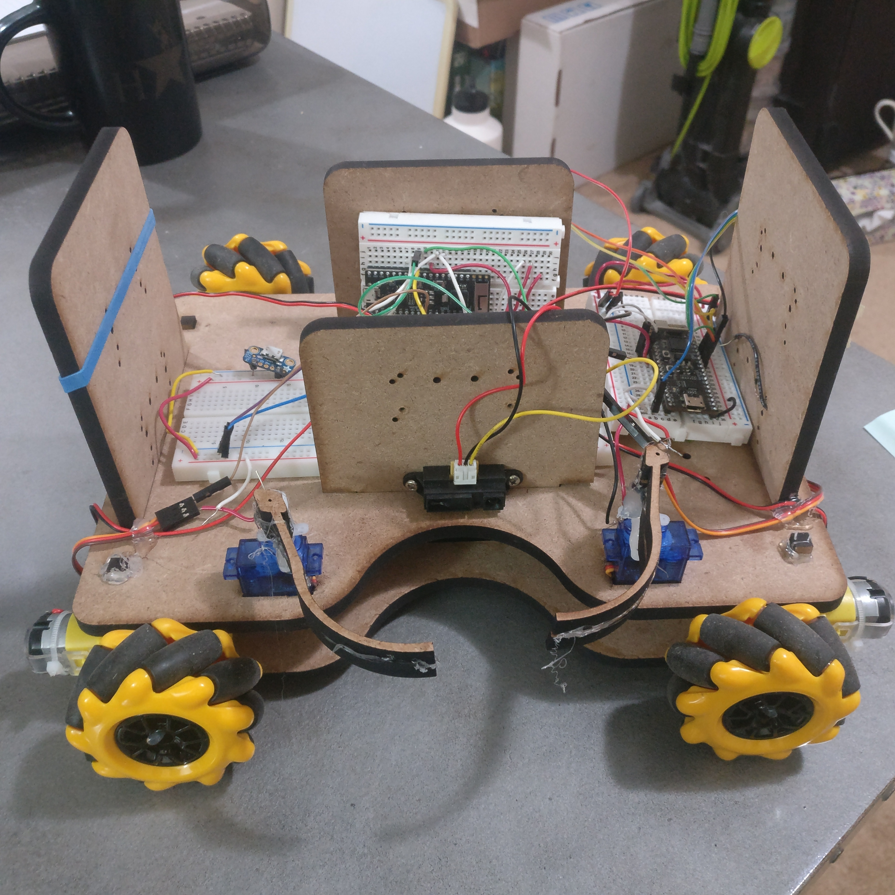
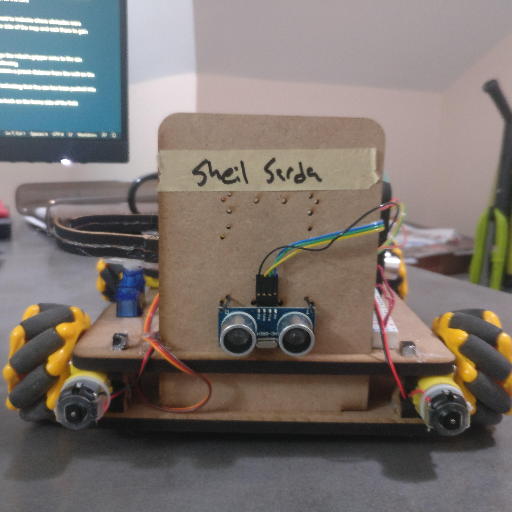
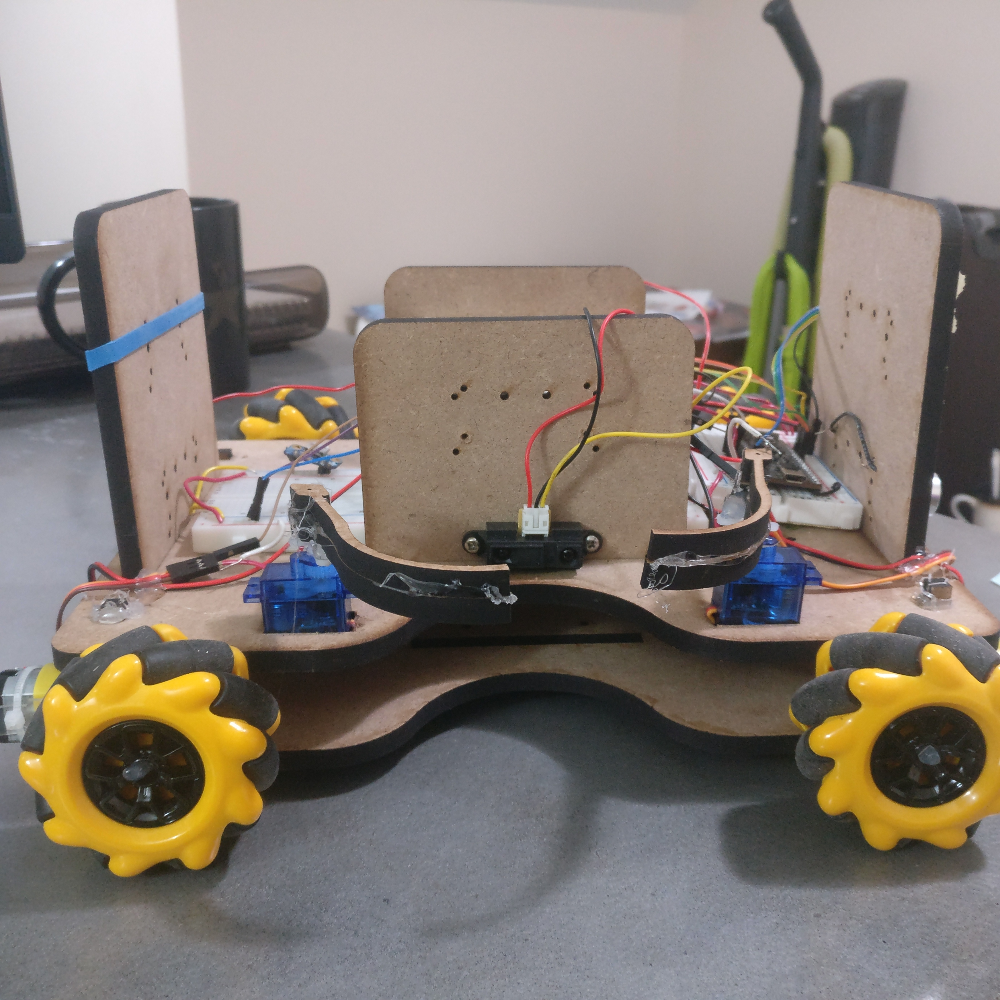
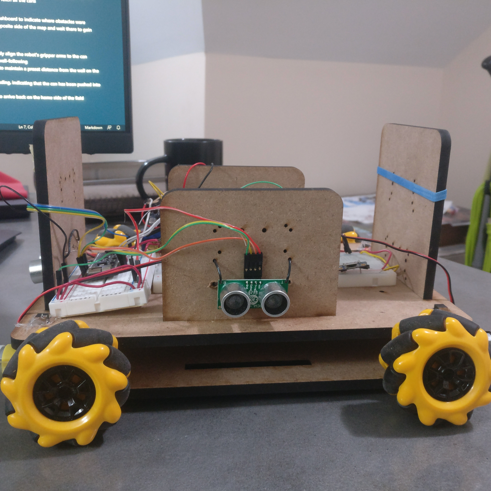
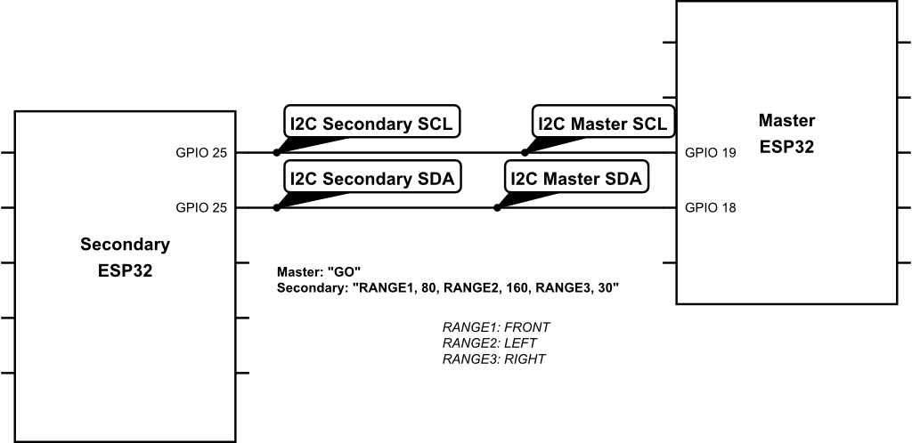
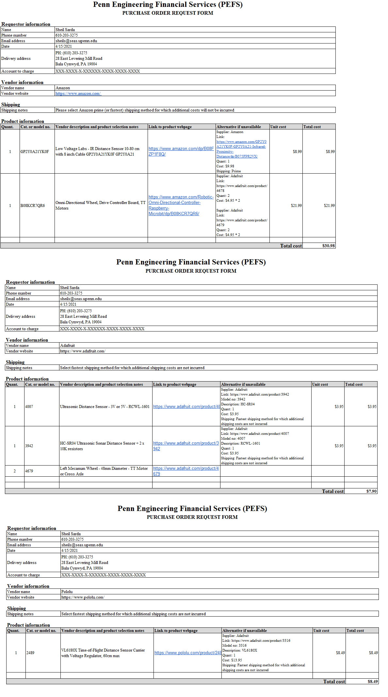
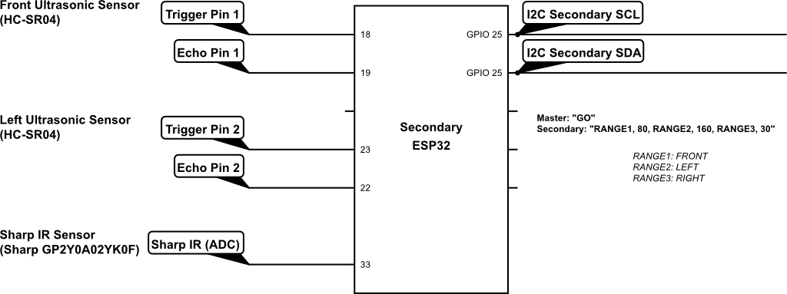
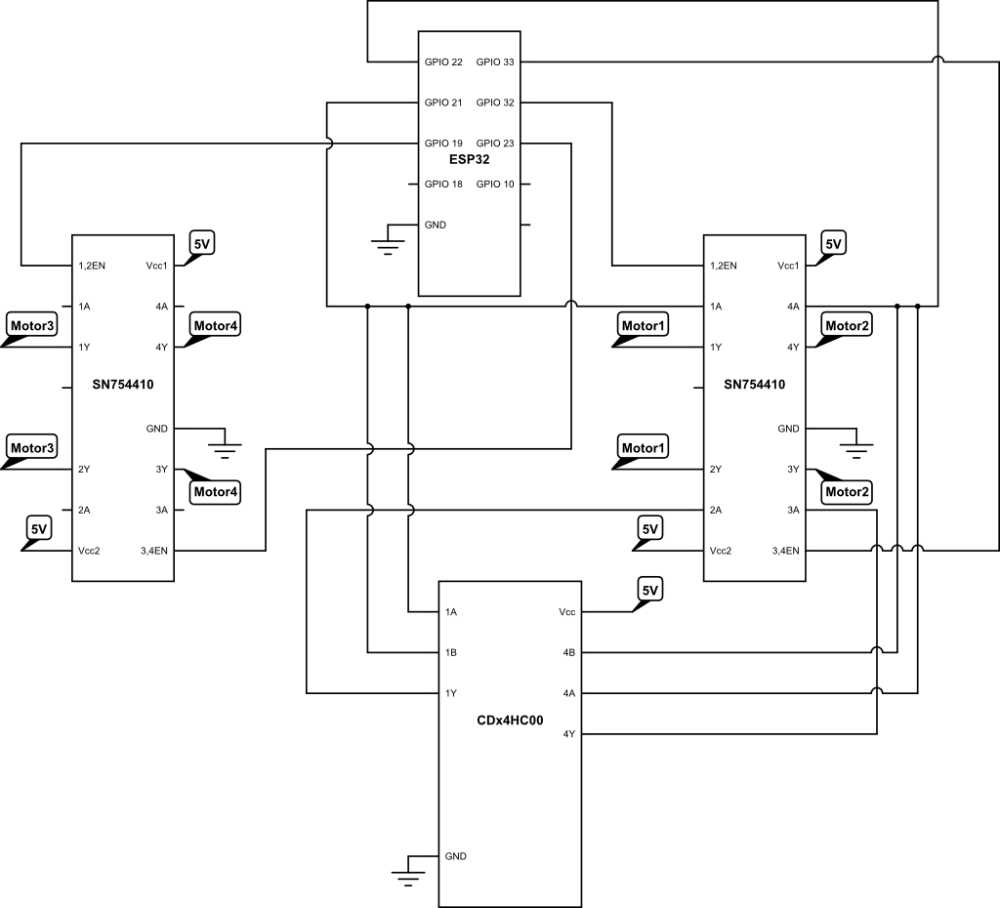
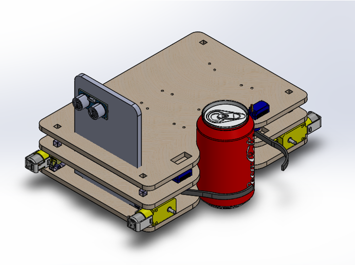
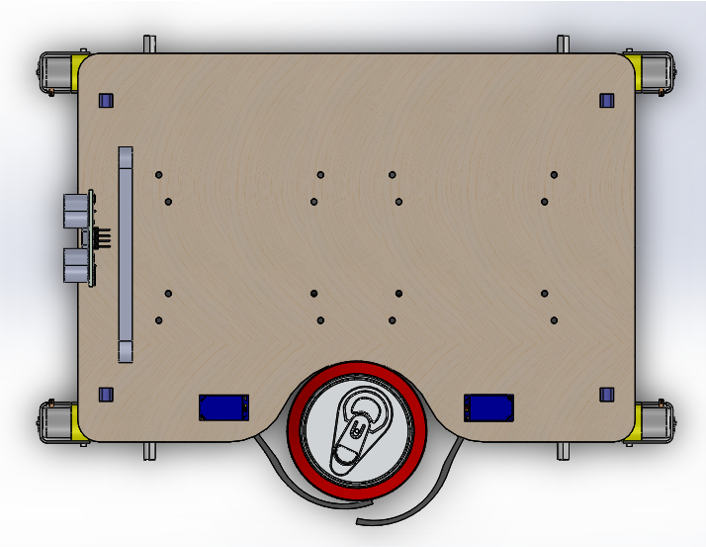

# Lab 5 - Final Project Report

Sheil Sarda <sheils@seas.upenn.edu>

## Functionality
### Pictures of Robot

### Strategy for the Game (Minimal Functionality)

#### *Can Grabbing*

My approach to can grabbing evolved over the course of the competition from using gripper arms to pushing cans and beacons.

Approach 1: **Gripper Arms**:

- Design approved prior for manufacturing used 2 servo motors with arms to lock in the can 
- Main challenge with this design was that servo arms did not have enough torque to keep the can locked during movement
- Also the servo horn did not stay locked on to the servo even with the aid of hot glue

Approach 2: **Can Pushing**:

- With holonomic drive the robot can easily navigate around the beacon and push it into the doubling zone
- Only drawback with this approach is the robot cannot pull in cans or beacons that are located near the edge of the map because it doesn't have the space to nudge itself between the wall and can 
- Lost a few matches because robot pushed the beacon into the wall and was unable to move it closer to the center
- Partnership with Rafael for the playoff games allowed me to focus on just pushing the beacon into the doubling zone and then venture out in the opposing side to get time points, so did not have to worry about getting cans from the periphery of the map since his nimble robot was able to fetch all the cans

#### *Autonomous Modes*

- Left, Right and Front sensor ranging data was available on my dashboard to indicate where obstacles were
- Could leverage wall-following behavior to drive myself to the opposite side of the map and wait there to gain points

### Extra Components / Functionality

- Using a short-range Time-of-Flight (ToF) sensor to autonomously align the robot's gripper arms to the can
- ToF range was < 10cm so it would not be sufficient to also do wall-following
- Use the Sharp IR sensor also located on that side of the robot to maintain a preset distance from the wall on the robot's left and detect cans in an interrupt-driven manner
- Once can is detected, minimize the distance that the ToF is reading, indicating that the can has been pushed into reach of the grippers
- Close the grippers, turn 180 degrees, and use wall following to arrive back on the home side of the field

*BOM in Appendix*

## Mechanical Design

### Lessons for improvement

- Sensor mounts were too high for the walls of the field, so had to drill new mounting holes in the front, right and left plates to mount the ultrasonic and Sharp IR sensors lower
- Cutout for picking up the can was too small, so it was hard to precisely align the robot to pick up the can just through visual feedback over the internet
- Making motor mounts out of 0.25" MDF meant that I was not able to find long enough screws to go through both sides and secure them with a nut (25mm is the largest size available in the GM lab)

### Actual vs Intended performance

Besides the evolving can grabbing approach described in the previsous ection, another difference between simulated vs actual performance was that over time, motors started to wiggle left and right making it harder to strafe with the holonomic drive since the geometry of the wheels was changing

*CAD drawings in Appendix*

## Electrical Design

### Actual vs Intended performance

- Actual vs Intended performance was as expected for all the motor driving parts since I was reusing most of the same components from the racecar lab
- Reliably reading sensor data was a new expereince for me, and all went to plan since I was able to use the I2C setup code to relay values from the secondary ESP32 to the primary one

### Lessons for Improvement

- Plan out the pin-out diagram for wiring all the sensors before purchasing them, since this would have highlighted the fact that I would not be able to use my I2C-based ToF sensor before it was too late
	- I2C pins on my secondary ESP32 were occupied with its connection to the primary ESP32
	- As an alternative, could have used a Teensy as a 3rd microcontroller in my circuit, utilizing its master I2C pins, and also connected it to the I2C bus from the secondary to the the primary ESP32

*Schematics in Appendix*

## Processor architecture and code architecture

### Block diagram of MCU

### Software approach

Used I2C distributed computing approach
- **Master ESP32** was responsible for:
	- Web Server Hosting
	- Motor Control for drivetrain
	- Requesting Sensor data from Secondary ESP32 and doing wall-following + displaying it on webserver via Ranging view
	- Controlling grippers for grabbing cans 
- **Secondary ESP32** was responsible for:
	- Using Analog reads to read in data from Front and Left ultrasonic sensors
	- Using I2C to read in data from the Sharp IR sensor
	- Communicating range information to the primary ESP32 via I2C
- **Web Interface** for control:
	- Started with joystick control and customized it for holonomic drivetrain
	- Integrated ranging code on the joystick view
	- Added Gripper open / close buttons
	- Added discrete movement buttons for N / S / E / W movements which propel the robot in precise distances, previously impossible with just the joystick 

### Lessons for Improvement

Do not underestimate the value of adding more buttons for automating movement patterns that are commonly used in races

- Follow Left / Right wall
- Rotate around the control tower in the center of the map to sweep away cans located there
- Use control law to wall-follow a specific distance away from the wall using text box on web interface

## Retrospective

### Most important thing learned

- Importance of good design choices
- How to make a strong yet nimble robot
- How to design a good UI for controlling robots

### What was the best parts of the class

How willing to help all the TAs were in troubleshooting my robot and helping debug potential issues over Zoom once I had dropped off the robot for the final competition

### What you had the most trouble with

Using the final competition guidelines to design a purpose-built robot which would be great at doing the main objectives well. E.g. how Rafael's nimble robot was able to quickly pick up cans and beacons 

### What you wish was improved

Helping students visualize what the final match was going to look like, either by staging a TA robot fight or simulating it virtually

### Anything else about class

One of the best courses I have taken in my 4 years at Penn. Huge thank you to all the TAs and Prof. Mark Yim for making the experience so engaging and entertaining

## Appendix

### BOM (Bill of Materials)

### Schematics of all electronic circuits

### Photo / Rendering of full robot

### CAD drawings

### All data sheets for all components that are not parts supplied by the ministore (either links or copies of data sheets)

1. [VL6180X](https://www.st.com/resource/en/datasheet/vl6180x.pdf): https://www.st.com/resource/en/datasheet/vl6180x.pdf
1. [Sharp GP2Y0A02YK0F](https://www.sparkfun.com/datasheets/Sensors/Infrared/gp2y0a02yk_e.pdf): https://www.sparkfun.com/datasheets/Sensors/Infrared/gp2y0a02yk_e.pdf
1. [HC - SR04](https://cdn.sparkfun.com/datasheets/Sensors/Proximity/HCSR04.pdf): https://cdn.sparkfun.com/datasheets/Sensors/Proximity/HCSR04.pdf

### Videos of functionality

Final Project Day 3 (Finals): https://youtu.be/rbyzACLpvsc?t=13435

### Upload all code to canvas (separately)
