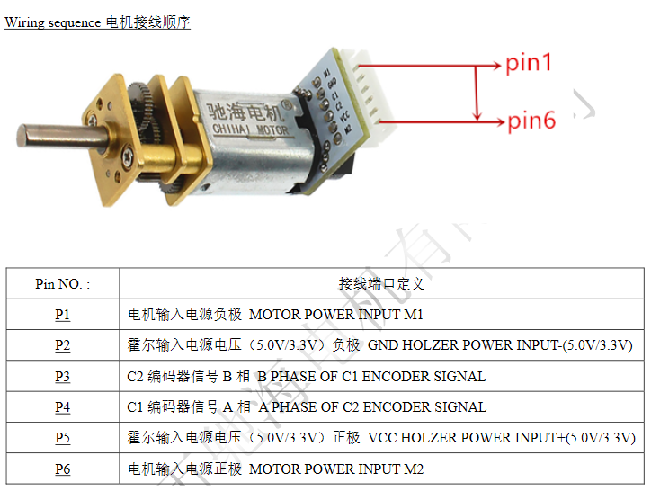
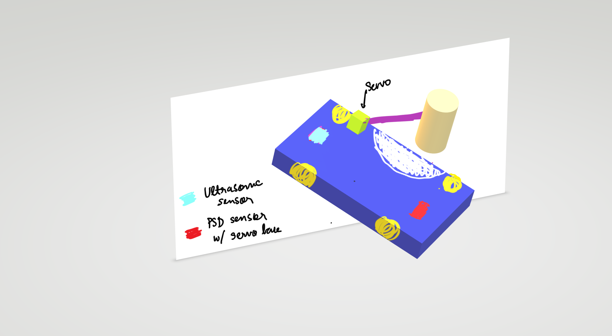
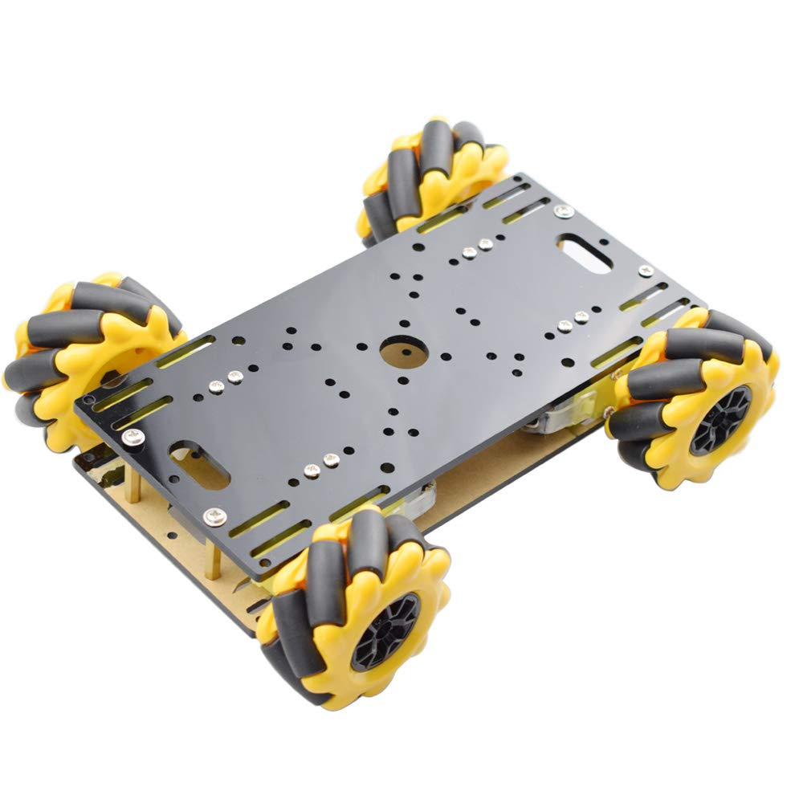

# Lab 5 - Final Project

Sheil Sarda <sheils@seas.upenn.edu>

## Sensor List

1. [Reflective Infrared IR Optical Sensor](https://www.adafruit.com/product/2349)
    - Also available on [Digikey](https://www.digikey.com/en/products/detail/tt-electronics-optek-technology/OPB742/374792?s=N4IgTCBcDaIMwDYCsBaAjABjQFhQOQBEQBdAXyA)
    - Cost: $1.95
    - Detection range is ~0.2-0.10cm
    - [Datasheet](https://www.ttelectronics.com/TTElectronics/media/ProductFiles/Optoelectronics/Datasheets/OPB708-709-740-748.pdf)
1. Ultrasonic Ranging
    1. [RCWL-1601](https://www.adafruit.com/product/4007)
        - Cost: $3.95
        - Range: 10cm – 250cm
        - Speed: ~10 samples/sec
        - Beam width: ~75 degrees
    1. [HC-SR04](https://www.adafruit.com/product/3942)
1. [Sharp GP2Y0A21YK0F](https://www.pololu.com/product/136)
    - Cost: $10.90
    - Also available on [Adafruit](https://www.adafruit.com/product/164) for $14.95
    - Analog output can be connected to ADC pin for distance measurements
    - Detection range is ~10-80 cm (4″ to 32″)
    - [Datasheet1](http://www.socle-tech.com/doc/IC%20Channel%20Product/Sensors/Distance%20Measuring%20Sensor/Analog%20Output/GP2Y0A21YK0F_spec.pdf), [Datasheet2](https://global.sharp/products/device/lineup/data/pdf/datasheet/gp2y0a21yk_e.pdf)
    - Distance range: 10-80cm / 4-31inches
1. Time of Flight Distance Ranging
    1. [VL6180](https://www.adafruit.com/product/3316)
        - Cost: $13.95
        - Distance range: 0.5-20cm 
    1. [VL53L0X](https://www.adafruit.com/product/3317)
        - Cost: $14.95
        - Distance range: 5-120cm  

| Range | Sensor | Quantity | Seller |
|--|--|--|--|
| Long      | Sharp IR              | 1 | Amazon    |
| Short     | ToF Distance Ranging  | 1 | Pololu    |
| Short     | Ultrasonic            | 2 | Adafruit  |

## Actuator

1. 6V N20 DC Motor with Magnetic Encoder  
    - 1:50 Gear Ratio
    - Cost: $12.50
    - [Datasheet](https://www.adafruit.com/product/4638#technical-details)
    - [Motor shafts to use orange wheels](https://www.pololu.com/categMory/179/motor-shaft-adapters)

        
1. SG90 Servo

## Base and Wheels

| Part | Cost |
|--|--|
| [Right Mecanum Wheel - 48mm Diameter](https://www.adafruit.com/product/4678)  | $4.95 * 2 = $9.90 |
| [Left Mecanum Wheel - 48mm Diameter](https://www.adafruit.com/product/4679)   | $4.95 * 2 = $9.90 |

**NOTE** Designed for 1/4" MDF instead of the usual 1/8"

### Soda Can Dimensions (inches)

|  |  |
|--|--|
Height | 4.83 |
Diameter (top) | 2.13 |
Diameter (body) | 2.6 |
Volume | 12 ounces |
| | |

## Holonomic Drive Refs

1. [Details of Mecanum Drive](https://www.servomagazine.com/magazine/article/a-look-at-holonomic-locomotion)

## Autonomous Behaviors

1. Follow the wall till you get to the can, pick it up and go back in reverse
1. Follow the beacon using a photo-reflective pair, pick up the can and follow a line on the way back

## Learnings from Lab 4

- Better controller design for 3-wheeled drive
- Better motor mounts than MDF
- Use Acrylic instead of MDF for entire chasis construction
