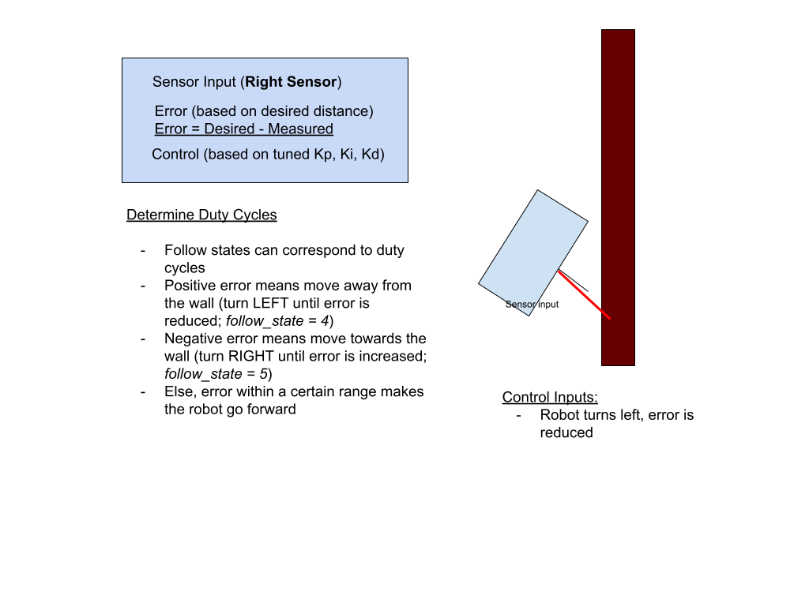
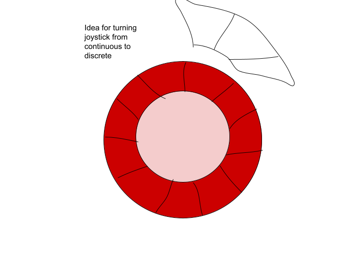

# Lab 5 Scripts

## TODO LIST

Events and Services Model
1. FSM
1. Interrupts
1. Sensors
1. Web input
1. Web interface inputs to FSM

Hardware
1. PID Control
	1. Control for ultrasonic
	1. ToF
1. Drive Motor Control
	1. Limit Switches
	1. IR Retroreflective
1. Servo Motor Control
	1. Can detection
	1. Can picking up
	1. Can release

Communication
1. Figure out SPI / I2C for ESPs
1. SPI / I2C for 2 ESP

Web Interface
1. Buttons for autonomous mode
1. Ranging code to get sensor data
1. Increase resolution of joystick
	1. Discrete
	1. Bigger joystick
1. Add rotation functionality

Holonomic drive to do using `LEDC_Write`
1. Forward
1. Backward
1. Left 
1. Right
1. Turn CW / CCW by X degrees

Plan for capacitive touch:
1. Have capacitive touch sensors on the top layer of the bot to detect whether a potential object is a can or not
1. Also have capacitive touch sensors inside the gripper arms so we know the precise location of the can in relation to the robot geometry
1. Actuate the servo closest to the can first, have a tiny delay, then actuate the second robotic arm-- prevent accidentally tipping over the can


## Walker's Wall Following code

### Wall Following Modes

| Follow State | Mode | Next Mode |
|--|--|--|
| Drive slight right and bang the wall, then go slightly left | 0 | 0 |
| Drive slight left, then go slight right until you hit the wall | 1 | 0 |
| Back up, then turn slightly left | 3 | 4 |
| Drive slight left | 4 | 5 |
| Slight right turn | 5 | 0 |

### PID Control with Follow States



### Modifying the Interface



### Finite State Machine Skeleton

````cpp
void handleWallFollow()
{
  static long last_right = millis();
  static long last_front = millis();
  static long since_turning_left = millis();
  static long since_turning_slight_left = millis();
  uint32_t ms2;

  ms2 = millis();

  //handle button states
  //may want to do this with interrupts
  int right_button = digitalRead(22);
  int front_button = digitalRead(23);
  int delay_bounce = ? ? ;      //how long (ms) to turn left after the right button is pressed
  int delay_back = ? ? ;        //how long to back up (ms) after the front button is pressed
  int delay_left = ?      ? ;   //how long to turn left (ms) after backing up
  int delay_slight_left = ? ? ; //how long to turn slight left (ms) after turning hard left - this returns the robot to close to the wall

  Serial.printf("right: %d, front: %d, follow_state: %d \n", right_button, front_button, follow_state);

  // Which Limit Switch is Pressed -> Front or Right

  if (right_button)
  {
    // turn slight left for delay_bounce ms
    follow_state = 1; // bounce
    last_right = millis();
  }

  if (front_button)
  {
    // back up and turn
    follow_state = 3;
    last_front = millis();
  }

  /** 
   * Motor Driving Code
   */

  if (follow_state == 0)
  { // DRIVE SLIGHT RIGHT
    //drive slight right
    //insert motor driving code here
  }

  if (follow_state == 1)
  { //DRIVE SLIGHT LEFT FOR delay_bounce MS
    if (ms2 - last_right > delay_bounce)
    {
      //turn slight right until hit the wall
      follow_state = 0;
    }
  }

  if (follow_state == 3)
  {
    if (ms2 - last_front > delay_back)
    {
      //hard left turn
      follow_state = 4;
      since_turning_left = millis();
      //insert motor driving code here
    }
  }

  if (follow_state == 4)
  {
    if (ms2 - since_turning_left > delay_left)
    {
      // slight left
      since_turning_slight_left = millis();
      follow_state = 5;
      //insert motor driving code here
    }
  }

  if (follow_state == 5)
  {
    if (ms2 - since_turning_slight_left > delay_slight_left)
    {
      //slight right
      follow_state = 0;
    }
  }
}
````
