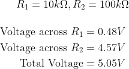
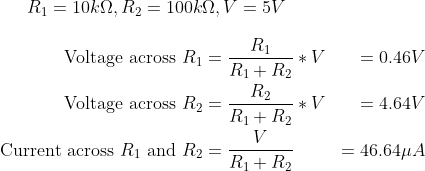
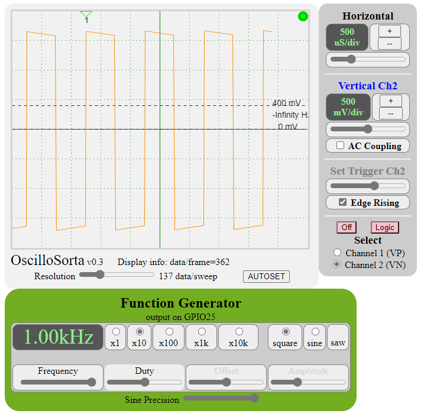
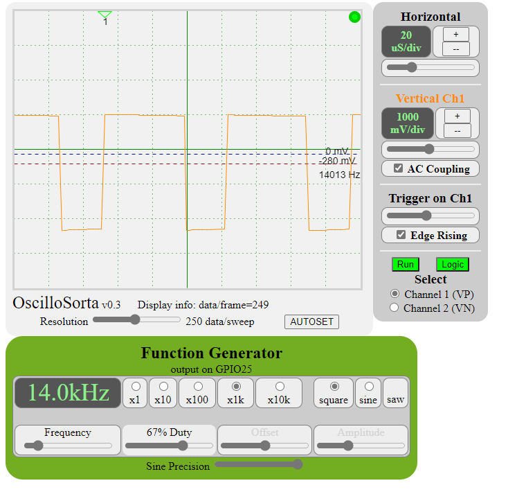

# Lab 0 - COVID Edition

## 1. Multimeters

### 0.1.1 What happens if you use the wrong two plugs to measure something? ​

- Multimeter can explode because of a short-circuit
- Measurement can be incorrect and meaningless

### 0.1.2 What types of readings can your multimeter measure? 

- DC Voltage
	- 200mV to 600V
	- 0.5% Accuracy
- DC Current
	- 2mA to 10A
	- 1-3% Accuracy
- AC Voltage
	- 200V to 600V
	- 1.2% Accuracy
- Resistance
	- 200Ohms to 2MegaOhms
	- 0.8% Accuracy

### 0.1.3 Find a battery and measure the voltage across the battery. 

The voltage is lower than the advertised voltage of the battery. This is expected because this is a used battery (from a TV remote), so some of its charge has been depleted. As the internal resistance of the battery increases, its voltage decreases. 

### 0.1.4 Connectivity test 

2 things that are connected:

- Jumper cable 
- Same end of the battery

## 2. Power Supply

No questions for submission.

## 3. Resistors

### 0.3.1 Use the DMM to measure a variety of resistors from your kit in both series and parallel

- Combine two different resistors in parallel, and take a separate measurement of two in series. Are the readings within tolerances? 

|            	| Measured 	| Theoretical 	| Parallel / Series 	| Within Tolerance? 	|
|------------	|----------	|-------------	|-------------------	|-------------------	|
| 1K + 10K   	| 10.9K    	| 11K         	| Series            	|               Yes 	|
| 10K + 10K  	| 19.8K    	| 20K         	| Series            	|               Yes 	|
| 10K + 100K 	| 8.9K     	| 9.1K        	| Parallel          	|               Yes 	|

#### Holding resistor to the probes with fingers touching probes

Resistivity decreased when touching the probes because our body's resistance (estimated between 300-1000 Ohms) gets added in parallel to the circuit, lowering the net effective resistance.

### 0.3.2 Connect the two resistors that are larger than 1Kohm in series on the protoboard

#### Measured

- Attach one end of the two to 5V of the battery and the other end to ground. 
- Measure the voltage at the three points of the two resistors (each end and the middle). 
- What is the voltage? 

#### Theoretical

- How does this match expectation as a voltage divider? 
- What would the current be going through either resistor?

## 4. Oscilloscope

### 0.4.1

### 0.4.2

### 0.4.3

### 0.4.4 Voltage Divider

- In this case, there are three legs, the source signal (e.g., the scope probe tip), the line to the scope (e.g., the wire that goes to the scope or OscilloSorta) and ground. 

- Find two resistors from the kit that can be used in this fashion to reliably measure signals that may be around 5V (may be a little higher or a little lower). 

- Be sure that 5V is not going directly into the ESP32 pin as this may damage it. 

- Take a picture of the breadboard setup with the resistors, and OscilloSorta wires going to Channel 1. 

- Submit this picture and clearly indicate which wires go to the source signal, to Channel 1 of the ESP32 and to ground. 

- Submit a screen shot or photo of OscilloSorta scope face showing the output when the source signal is 5V from the BESTON power battery (and sharing the same ground) and the output.

### 5. Function Generator

No questions for submission.

### 6. Retrospective 

Spent approximately 10 hours on this lab.