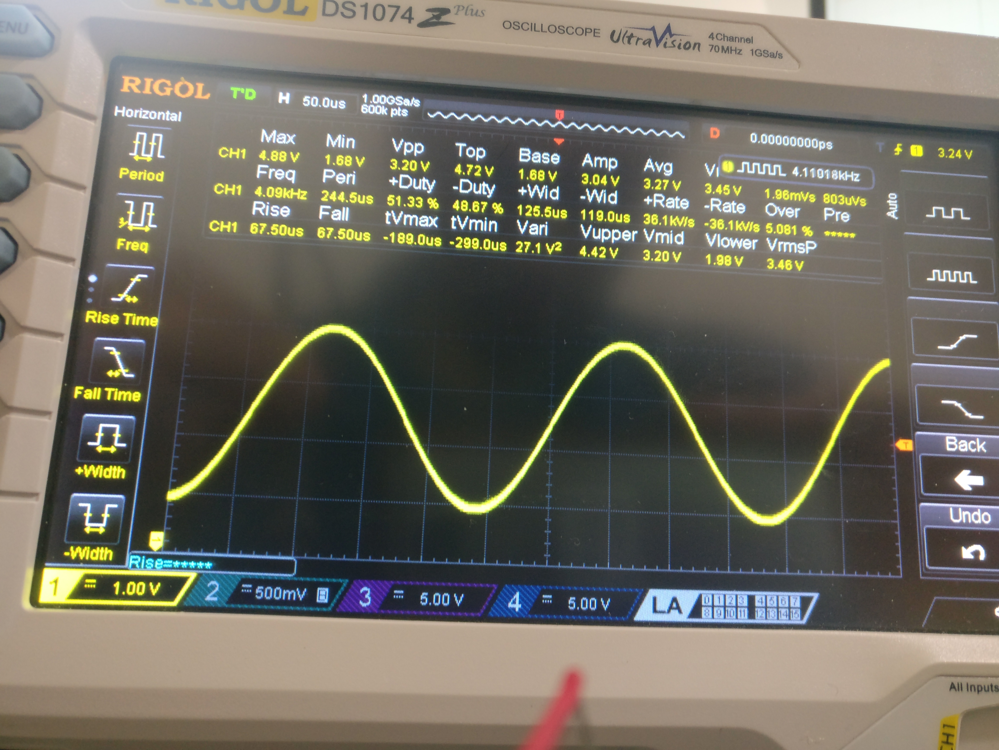
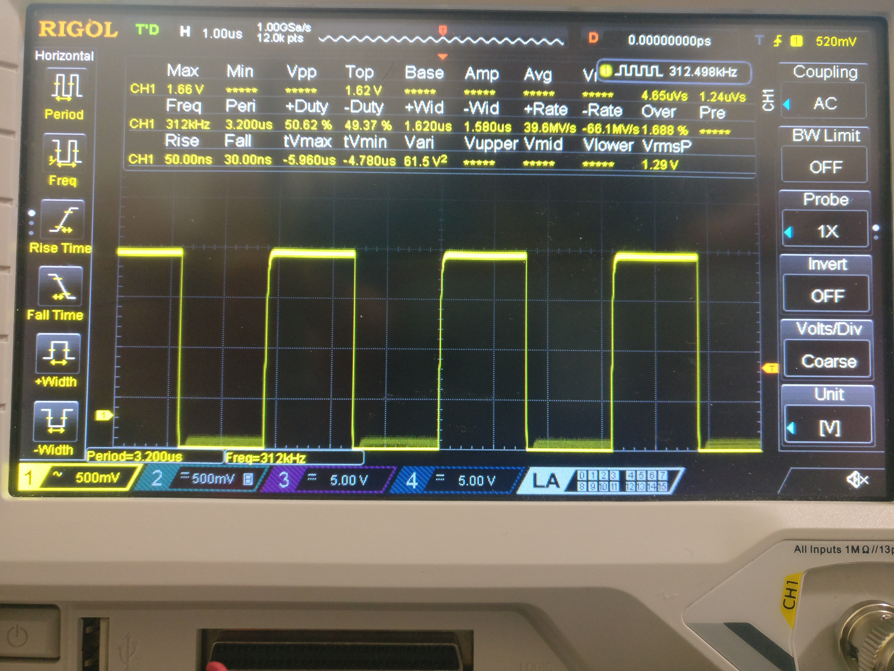
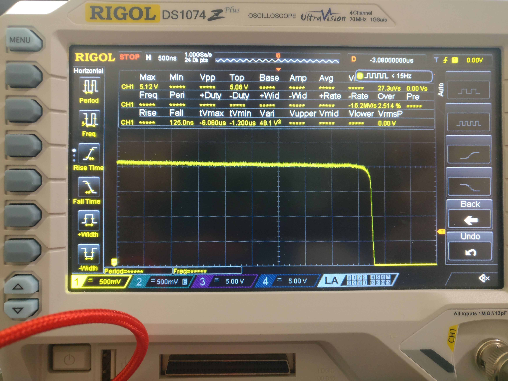

# Lab 6 - Oscilloscope Activity

Sheil Sarda <sheils@seas.upenn.edu>

## 1. Time and Voltage Scale

3.3V sine wave signal at approximately 4000Hz

1. Adjust the time scale so there are between 4 and 8 cycles on the screen
1. Adjust the voltage scale so that the wave takes up at least half of the screen
1. Take a photo of the real scope face showing the triggered signal

Highest frequency square wave

## 2. Single Mode

## 3. OscilloSorta feedback

