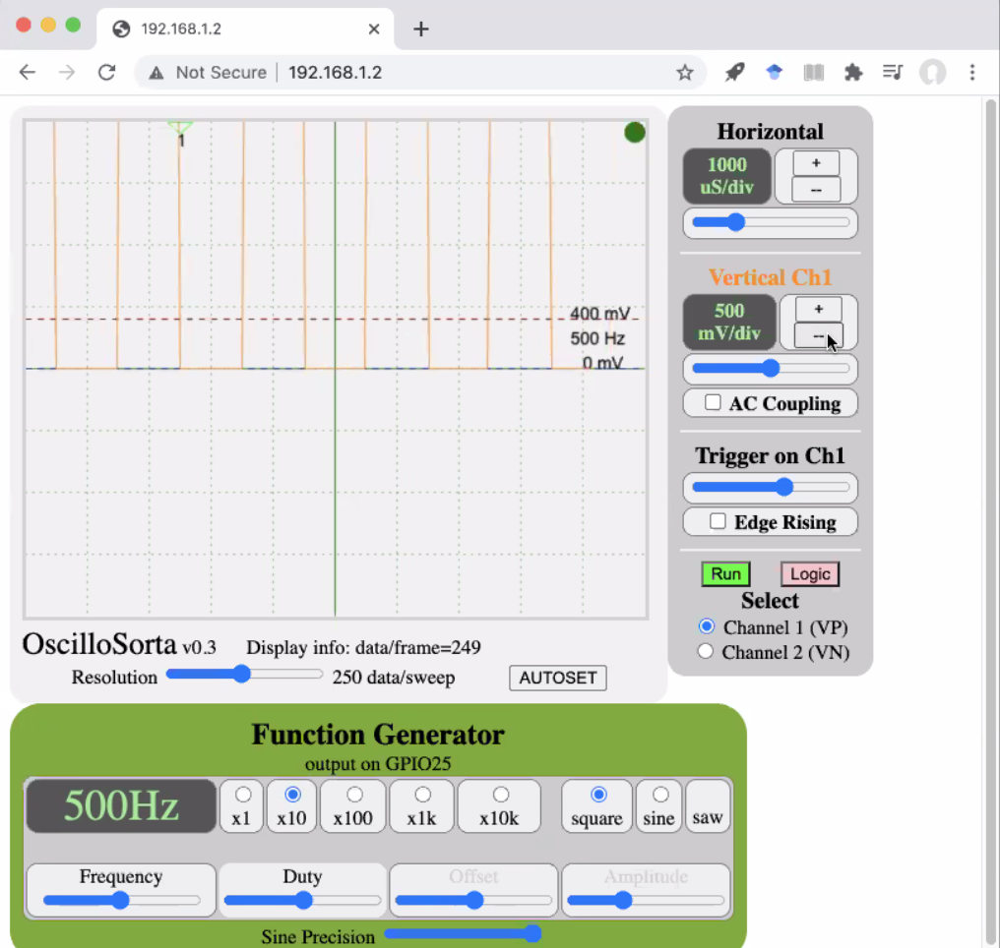
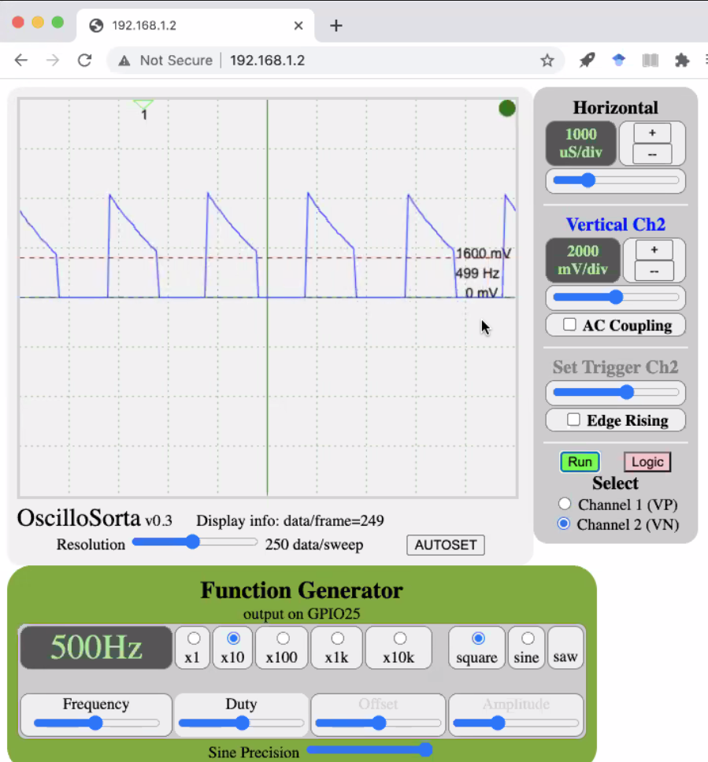
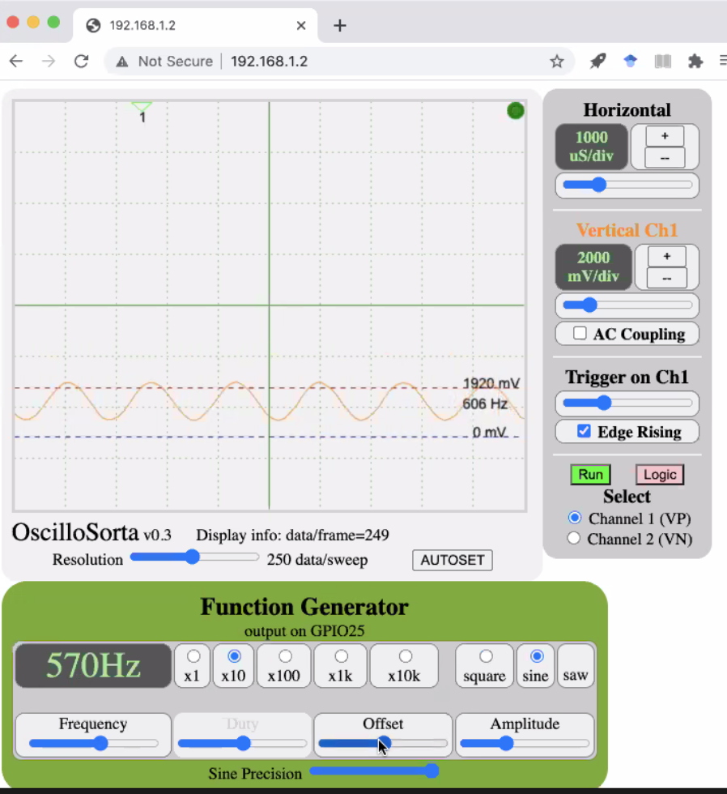
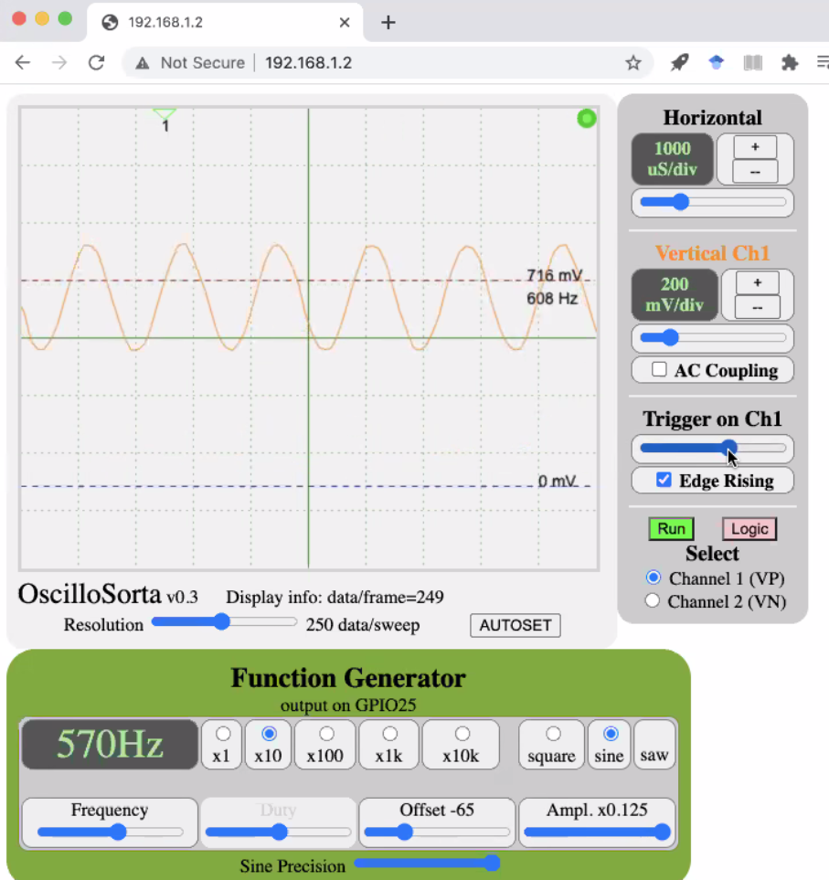
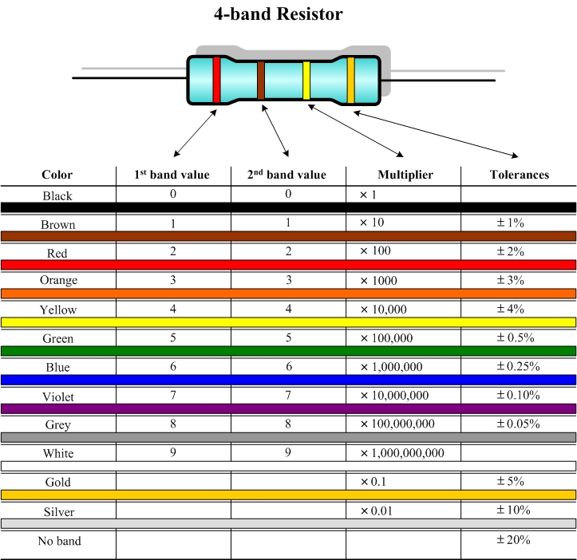
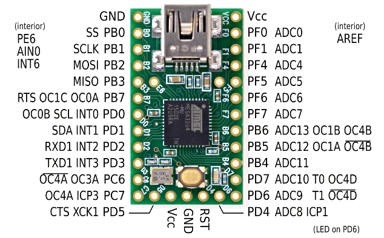
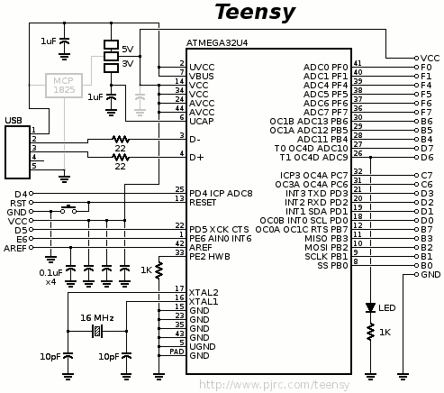

# Equipment Overview and Best Practices

## Soldering Iron

- Medium temperature (somewhere in the middle)
- Add a rubber band to increase circumference so it sticks in the stand
- When soldering in headers where you don't need all the pins, push out the ones you don't need
- Iron takes a long time to heat up

#### Dos

- Get the pin and pad hot enough to melt the solder
- Solder just flows between them and creates good contact
- The hotter the soldering iron, the quicker oxides form
- Oxides are the bane of soldering - nothing really sticks on them
- Always keep the tip clean

#### Don'ts

- When you get it wrong, and you try to put more on there and it just gets worse
- Don't try to paint on the solder to the pin after you put it on the iron

## Solder Sucker

- Put some solder on the iron, use the iron to heat up the joint
- Bring the sucker close to the joint, and once everything is heated suck it up

## Oscilloscope

[Using OScopes](https://www.youtube.com/watch?v=lSHAE_Y6snc)

- Vertical Channel slider is the ground slider
- Red line is the trigger
	- If signal is crossing the trigger, the OScope locks on to the signal
	- Green triangle appears at the top which points to where the signal is locked
	- If you change the trigger or Horizontal so that it no longer intersects with trigger, triangle turns red
	- Edge rising checkbox locks it on the rising edge
- Voltage on the trigger line is voltage above ground
	- Can move the trigger to measure how high the peak is 
- Frequency on the trigger line is frequency of the wave it's intersecting with
- Horizontal add and subtract buttons adjusts the time scale
- Horizontal slider translates the wave horizontally
- Can go up to 3KHz frequency
	- Speed is limited to how quickly wifi packets are sent
	- If blinking light breaks, the wifi packets are paused so readings are not accurate

**Fig. 1 Function Generator 1**



**Fig. 2 Function Generator 2**



**Fig. 3 Trigger Line**



**Fig. 4 Sine Wave**



## Voltage Divider

- Practice using resistors in a voltage divider
- Can do it any way we want within the safe power restrictions
- Same function as a normal OScope used to do a times 10 probe

## Resistors

[Online Register Calculator](https://www.digikey.com/en/resources/conversion-calculators/conversion-calculator-resistor-color-code)



## Datasheets

Always use maximum Voltage and Current numbers when designing a system. Plan for the worst case.

## C Syntax

Logic Macros

````c
#define OFF 0
#dfine ON 1
#define ever (; ;)
#define runXtimes(x) for (int i = 0; i < (x); ++i)
````

Bit Shifting macros

````c
#define set(reg, bit) reg |= (1 << (bit))
#define clear(reg, bit) reg &= ~(1 << (bit))
#define toggle(reg, bit) reg ^= (1 << (bit))
````

## Teensy 

### Pinout

More in-depth breakdown of pins can be found [here](http://medesign.seas.upenn.edu/index.php/Guides/Teensy-pins).





### [Teensy Setup](Teensy_Setup.md)
